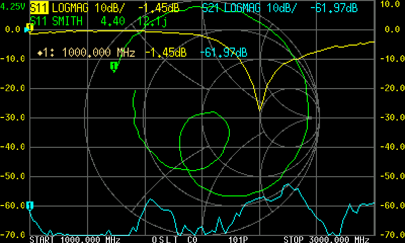
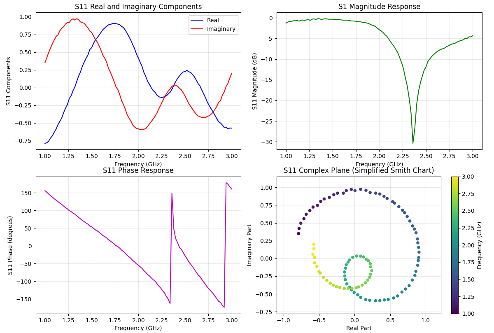
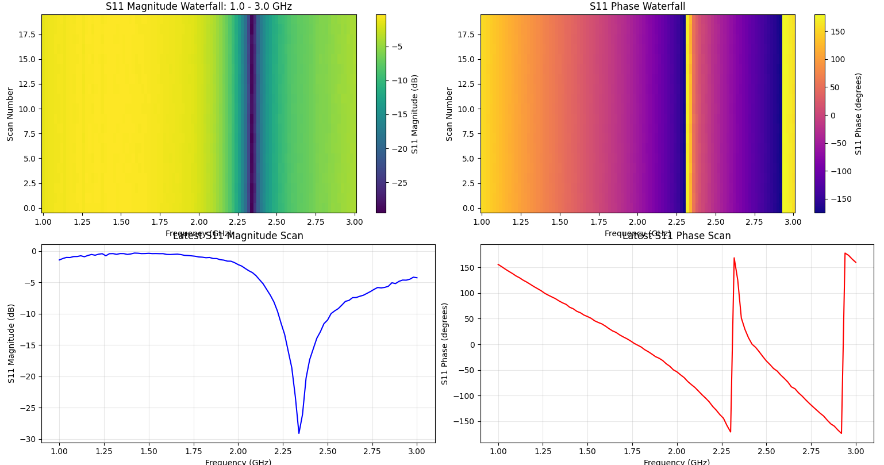
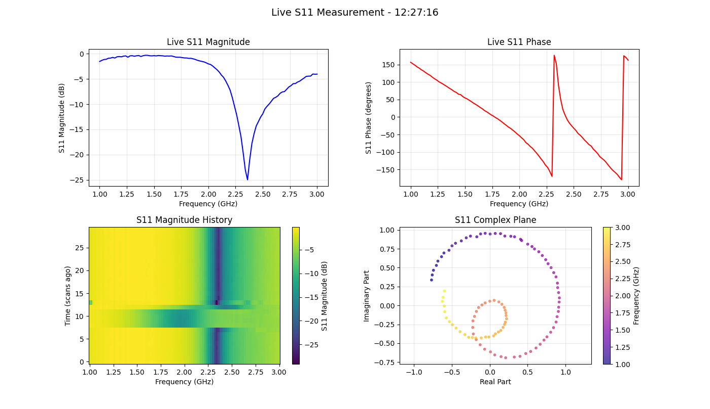

# nanoVNA_python
simple non-GUI Python interfacing and data saving for the NanoVNA. Includes examples

# INPROGRESS, UNSTABLE. Check back Mid-July for something workable 

## AN UNOFFICIAL Python Library for the NanoVNA Device Series

A Non-GUI Python API class for the NanoVNA series of devices. This repository uses official resources and documentation but is NOT endorsed by the official NanoVNA product or company. See the [references](#references) section for further reading. See the [official NanoVNA resources](https://nanovna.com/) and the [active user group](https://groups.io/g/nanovna-users/) for device features.


There also exists several officially recognized resources:
* [NanoVNA-App](https://nanovna.com/?page_id=141), download available on official page
    * With development at [https://github.com/OneOfEleven/NanoVNA-App](https://github.com/OneOfEleven/NanoVNA-App)   
* [NanoVNA-Saver](https://nanovna.com/?page_id=90)
    * With releases and download at [https://github.com/NanoVNA-Saver/nanovna-saver/releases](https://github.com/NanoVNA-Saver/nanovna-saver/releases)
* [NanoVNA-Web-Client / WebApp](https://nanovna.com/?page_id=26)
    * Works from https://cho45.stfuawsc.com/NanoVNA/ using the latest version of chrome browser, and as an Android .apk


This library, `nanoVNA_python`, is a non-GUI based library with access to low-level interfacing. It has been written as a companion to the [tinySA_python library](https://github.com/LC-Linkous/tinySA_python). Even though there is a lot of similarities between the devices, the library GitHub repositories are separate in order to make it clear which examples, tips, and documentation go to which device. 


This library covers most of the documented commands for the NanoVNA device series. The documentation is sorted based on the serial command, with some provided usage examples. While some error checking exists in both the device and the library, it is not exhaustive. It is strongly suggested to read the official documentation before attempting to script with your device.


Done:
* library commands for common args
* documentation for original command usage and library functions
* examples for basic functionality 
* some Debian-flavored Linux testing

Working on it:
* filling in unfinished args and any new NanoVNA features
* An argparse option + some example scripts
* Beginner notes, vocab, and some examples for common usage


## Table of Contents
* [The NanoVNA Series of Devices](#the-nanovna-series-of-devices)
* [Requirements](#requirements)
* [Library Usage](#library-usage)
* [Error Handling](#error-handling)
* [Example Implementations](#example-implementations)
    * [Finding the Serial Port](#finding-the-serial-port)
        * [Autoconnection with the nanoVNA_python Library](#autoconnection-with-the-nanovna_python-library)
        * [Manually Finding a Port on Windows](#manually-finding-a-port-on-windows)
        * [Manually Finding a Port on Linux](#manually-finding-a-port-on-linux)
    * [Serial Message Return Format](#serial-message-return-format)
    * [Connecting and Disconnecting the Device](#connecting-and-disconnecting-the-device)
    * [Toggle Error Messages](#toggle-error-messages)
    * [Device and Library Help](#device-and-library-help)
    * [Setting NanoVNA Parameters](#setting-nanovna-parameters)
    * [Getting Data from Active Screen](#getting-data-from-active-screen)
    * [Analysis of the Returned Data from the NanoVNA](#analysis-of-the-returned-data-from-the-nanovna)
        * [Types of Data Requests](#types-of-data-requests)
        * [Getting S11](#getting-s11)
        * [Getting S21](#getting-s21)
        * [Real, Imaginary, Phase, Smith](#real-imaginary-phase-smith)
    * [Saving Screen Images](#saving-screen-images)
    * [Plotting Data with Matplotlib](#plotting-data-with-matplotlib)
        * [Example 1: Plot Trace Data](#example-1-plot-trace-data)
        * [Example 2: Plot a Static Waterfall using SCAN and Calculated Frequencies](#example-2-plot-a-static-waterfall-using-scan-and-calculated-frequencies)
        * [Example 3: Plot a Realtime Waterfall using SCAN and Calculated Frequencies](#example-3-plot-a-realtime-waterfall-using-scan-and-calculated-frequencies)
        * [Example 4: Plot the Active Screen Data](#example-4-plot-the-active-screen-data)
    * [Saving SCAN Data to CSV](#saving-scan-data-to-csv)
    * [Accessing the NanoVNA Directly](#accessing-the-nanovna-directly)
* [List of NanoVNA Commands and their Library Commands](#list-of-nanoVNA-commands-and-their-library-commands)
* [List of Commands Removed from Library](#list-of-commands-removed-from-library)
* [Additional Library Functions for Advanced Use](#additional-library-functions-for-advanced-use)
* [Notes for Beginners](#notes-for-beginners)
    * [Vocab Check](#vocab-check)
    * [Calibration Setup](#calibration-setup)
    * [Some General NanoVNA Notes](#some-general-nanovna-notes)
* [FAQs](#faqs)
* [References](#references)
* [Licensing](#licensing)  

## The NanoVNA Series of Devices

The [NanoVNA line of devices](https://nanovna.com/?page_id=21) are a series of portable and pretty user-friendly vector network analyzer devices. There are several devices with different frequency ranges, so refer to [official documentation](https://nanovna.com/?page_id=21) to select one for your needs. There are also some very convincing knock-off devices, so ensure that you are purchasing an actual device from a [reputable vendor](https://nanovna.com/?page_id=121). 

This device is often compared to the [tinySA series of devices][https://tinysa.org/](https://tinysa.org/). The NanoVNA series is a handheld vector network analyzer (VNA), which measures the S-parameters (loosely: a type of response of a device or antenna) over at different frequencies, while a spectrum analyzer measures the amplitude of RF signals at different frequencies. There's a lot of overlap with the use of both devices, but the measurements are very different. A signal generator (one of the features of the tinySA) is exactly what it sounds like - it generates a signal at a specific frequency or frequencies at a specified power level.

Official documentation can be found at [https://nanovna.com/](https://nanovna.com/?page_id=21). The official Wiki is going to be more up to date than this repo with new versions and features, and they also have links to GUI-based software. Several community projects also exist on GitHub.

There is also a very active NanoVNA community at [https://groups.io/g/nanovna-users/](https://groups.io/g/nanovna-users/) exploring the device capabilities and its many features. 

The end of this README will have some references and links to supporting material, but it is STRONGLY suggested to do some basic research and become familiar with your device before attempting to script or write code for it. 


## Requirements

This project requires numpy, pandas and pyserial. 

Use 'pip install -r requirements.txt' to install the following dependencies:

```python
pyserial
numpy
pandas

```

The above dependencies are only for the API interfacing of the nanoSA_python library. Additional dependencies should be installed if you are following the examples in this README. These can be installed with 'pip install -r test_requirements.txt':

```python
pyserial
numpy
pandas
matplotlib
pillow
pyQt5
```

For anyone unfamiliar with using requirements files, or having issues with the libraries, these can also be installed manually in the terminal (we recommend a Python virtual environment) with:

```python
pip install pyserial numpy pandas matplotlib pillow pyQt5
```

`pyQt5` is used with `matplotlib` to draw the figures. `pyQT5` needs to be installed in Linux systems to follow the examples included in nanoVNA_python, but is not needed on all Windows machines. Install both if you have doubts; they're small packages and commonly used.


## Library Usage

This library is currently only available as the NanoVNA class in 'nanoVNA_python.py' in this repository. It is very much under development and missing some key error checking and handling. HOWEVER, ‘any’ error checking is currently more than the ‘no’ error checking provided by interfacing directly with the device. The code that is included in this repository has been tested on at least one NanoVNA device and is relatively stable. 

Several usage examples are provided in the [Example Implementations](#example-implementations) section, including working with the hardware and plotting results with matplotlib. 


## Error Handling

Some error handling has been implemented for the individual functions in this library, but not for the device configuration. Most functions have a list of acceptable formats for input, which is included in the documentation and the `library_help` function. The `nanoVNA_help` function will get output from the current version of firmware running on the connected tinySA device.

Detailed error messages can be returned by toggling 'verbose' on.


## Example Implementations

This library was developed on Windows and has been lightly tested on Linux. The main difference (so far) has been in the permissions for first access of the serial port, but there may be smaller bugs in format that have not been detected yet. 

### Finding the Serial Port

To start, a serial connection between the NanoVNA and user PC device must be created. There are several ways to list available serial ports. The library supports some rudimentary autodetection, but if that does not work instructions in this section also support manual detection. 


#### Autoconnection with the nanoVNA_python Library


The nanoVNA_python currently has some autodetection capabilities, but these are new and not very complex. If multiple devices have the same VID, then the first one found is used. If you are connecting multiple devices to a user PC, then it is suggested to connect them manually (for now). The NanoVNA and tinySA devices have the same VID and hardware identification for the serial ports.


```python
# import nanoVNA library
# (NOTE: check library path relative to script path)
from src.nanoVNA_python import nanoVNA 

# create a new nanoVNA object    
nvna = nanoVNA()

# set the return message preferences 
nvna.set_verbose(True) #detailed messages
nvna.set_error_byte_return(True) #get explicit b'ERROR' if error thrown


# attempt to autoconnect
found_bool, connected_bool = nvna.autoconnect()

# if port found and connected, then complete task(s) and disconnect
if connected_bool == True: 
    print("device connected")

    msg = nvna.get_info() 
    print(msg)
    

    nvna.disconnect()
else:
    print("ERROR: could not connect to port")

```


#### Manually Finding a Port on Windows
1)  Open _Device Manager_, scroll down to _Ports (COM & LPT)_, and expand the menu. There should be a _COM#_ port listing "USB Serial Device(COM #)". If your NanoVNA is set up to work with Serial, this will be it.

2) This uses the pyserial library requirement already installed for this library. It probably also works on Linux systems, but has not been tested yet.

```python

import serial.tools.list_ports

ports = serial.tools.list_ports.comports()

for port, desc, hwid in ports:
    print(f"Port: {port}, Description: {desc}, Hardware ID: {hwid}")

```

Example output for this method (on Windows) is as follows:

```python

Port: COM4, Description: Standard Serial over Bluetooth link (COM4), Hardware ID: BTHENUM\{00001101-0000-1000-8000-00805F9B34FB}_LOCALMFG&0000\7&D0D1EE&0&000000000000_00000000
Port: COM3, Description: Standard Serial over Bluetooth link (COM3), Hardware ID: BTHENUM\{00001101-0000-1000-8000-00805F9B34FB}_LOCALMFG&0002\7&D0D1EE&0&B8B3DC31CBA8_C00000000
Port: COM22, Description: USB Serial Device (COM10), Hardware ID: USB VID:PID=0483:5740 SER=400 LOCATION=1-3

```

"COM22" is the port location of the NanoVNA that is used in the examples in this README.


#### Manually Finding a Port on Linux

```python

import serial.tools.list_ports

ports = serial.tools.list_ports.comports()

for port, desc, hwid in ports:
    print(f"Port: {port}, Description: {desc}, Hardware ID: {hwid}")

```

```python

TO BE ADDED

```

This method identified the `/dev/ttyACM0`. Now, when attempting to use the autoconnection feature, the following error was initially returned:

```python
[Errno 13] could not open port /dev/ttyACM0: [Errno 13] Permission denied: '/dev/ttyACM0'

```

This was due to not having permission to access the port. In this case, this error was solved by opening a terminal and executing `sudo chmod a+rw /dev/ttyACM0`. Should this issue be persistent, other solutions related to user groups and access will need to be investigated.  


### Serial Message Return Format

This library returns strings as cleaned byte arrays. The command and first `\r\n` pair are removed from the front, and the `ch>` is removed from the end of the NanoVNA serial return.

The original message format:

# TODO: UPDATE EXAMPLE

```python
bytearray(b'infp\r\ndeviceid 0\r\nch>')
```

Cleaned version:

```python
bytearray(b'deviceid 0\r')
```

### Connecting and Disconnecting the Device
 This example shows the process for initializing, opening the serial port, getting device info, and disconnecting.

```python
# import nanoVNA library
# (NOTE: check library path relative to script path)
from src.nanoVNA_python import nanoVNA 

# create a new nanoVNA object    
nvna = nanoVNA()

# set the return message preferences 
nvna.set_verbose(True) #detailed messages
nvna.set_error_byte_return(True) #get explicit b'ERROR' if error thrown


# attempt to autoconnect
found_bool, connected_bool = nvna.autoconnect()

# if port found and connected, then complete task(s) and disconnect
if connected_bool == True: 
    print("device connected")

    msg = nvna.get_info() 
    print(msg)
    

    nvna.disconnect()
else:
    print("ERROR: could not connect to port")

```

Example output for this method is as follows:

```python

bytearray(b'Model:        NanoVNA-F_V2\r\nFrequency:    50k ~ 3GHz\r\nBuild time:   Mar  2 2021 - 09:40:50 CST\r')

```


### Toggle Error Messages

Currently, the following can be used to turn on or off returned error messages.

1) the 'verbose' option. When enabled, detailed messages are printed out. 

```python
# detailed messages are ON
nvna.set_verbose(True) 

# detailed messages are OFF
nvna.set_verbose(False) 
```

1) the 'errorByte' option. When enabled, if there is an error with the command or configuration, `b'ERROR'` is returned instead of the default `b''`. 

```python
# when an error occurs, b'ERROR' is returned
nvna.set_error_byte_return(True) 

# when an error occurs, the default b'' might be returned
nvna.set_error_byte_return(False) 
```

### Device and Library Help

The `help` return can be accessed via the `help()` function call. This will interface with the device directly and return functions based on the newest firmware, not information from the `nanoVNA_python.py` library.

```python

nvna.help()

```

The `help` command returns bytearray in the format `bytearray(b'commands:......')`

### Setting NanoVNA Parameters
TODO when error checking is complete to show multiple examples

```python

```
### Getting Data from Active Screen

See other sections for the following examples:
* [Saving Screen Images](#saving-screen-images)
* [Plotting Data with Matplotlib](#plotting-data-with-matplotlib)

This example shows several types of common data requests:

```python
TODO - updating the library with commands first


```

### Analysis of the Returned Data from the NanoVNA

#### Types of Data Requests

This example shows several types of common data requests:

```python
TODO - updating the library with commands first


```

#### Getting S11

#### Getting S21

#### Real, Imaginary, Phase, Smith


### Saving Screen Images
 
 The `capture()` function can be used to capture the screen and output it to an image file. Note that the screen size varies by device. The library itself does not have a function for saving to an image (requires an additional library), but examples and the CLI wrapper have this functionality.

 This example truncates the last hex value, so a single padding `x00` value has been added. This will eventually be investigated, but it's not hurting the output right now.

```python

# import NanoVNA library
# (NOTE: check library path relative to script path)
from src.nanoVNA_python import nanoVNA 

# imports FOR THE EXAMPLE
import numpy as np
from PIL import Image
import struct

def convert_data_to_image(data_bytes, width, height):
    # calculate the expected data size
    expected_size = width * height * 2  # 16 bits per pixel (BGR565), 2 bytes per pixel
    
    # error checking
    if len(data_bytes) < expected_size:
        print(f"Data size is too small. Expected {expected_size} bytes, got {len(data_bytes)} bytes.")
        if len(data_bytes) == expected_size - 1:
            print("Data size is 1 byte smaller than expected. Adding 1 byte of padding.")
            data_bytes.append(0)
        else:
            return
    elif len(data_bytes) > expected_size:
        data_bytes = data_bytes[:expected_size]
        print("Data is larger than the expected size. truncating. check data.")
    
    num_pixels = width * height
    
    # Unpack as little-endian 16-bit values
    x = struct.unpack(f"<{num_pixels}H", data_bytes)
    arr = np.array(x, dtype=np.uint32)
    

    # Convert RGB565 to RGBA
    # The NanoVNA uses BGR565 format.
    # This is a difference from the tinySA_python library which used RGB565. This is pulled out
    # into variables to make it clearer where/what the switch is.
    blue = ((arr & 0xF800) >> 11) * 255 // 31    # Blue in high bits (15-11)
    green = ((arr & 0x07E0) >> 5) * 255 // 63    # Green in middle bits (10-5)
    red = (arr & 0x001F) * 255 // 31             # Red in low bits (4-0)
    
    # Combine into RGBA format (Alpha = 255 for opaque)
    arr_rgba = 0xFF000000 + (red << 16) + (green << 8) + blue
    
    # reshape array to match the image dimensions
    arr_rgba = arr_rgba.reshape((height, width))
    
    # create and save the image
    img = Image.frombuffer('RGBA', (width, height), arr_rgba.tobytes(), 'raw', 'RGBA', 0, 1)
    img.save("example_screen_capture_demo.png")
    img.show()

# create a new tinySA object    
nvna = nanoVNA()

# set the return message preferences 
nvna.set_verbose(True) #detailed messages
nvna.set_error_byte_return(True) #get explicit b'ERROR' if error thrown


# attempt to autoconnect
found_bool, connected_bool = nvna.autoconnect()

# if port found and connected, then complete task(s) and disconnect
if connected_bool == True: 
    print("device connected")

    
    msg = nvna.get_info() 
    print(msg)
    
    # get the trace data
    data_bytes = nvna.capture() 
    # Printed out for fun. 
    # You do NOT need to print this to use it
    print(data_bytes)

    # disconnect device since we're not using it
    nvna.disconnect()

    # processing after disconnect (just for this example)
    # test with 800x480 resolution for NanoVNA-F V2
    convert_data_to_image(data_bytes, 800, 480) 

else:
    print("ERROR: could not connect to port")


```

<p align="center">
        
</p>
   <p align="center">Capture On-Screen Trace Data from 1 GHz to 3 GHzz</p>

### Plotting Data with Matplotlib

#### **Example 1: Plot Trace Data**
This example plots the last/current sweep of data from the NanoVNA device. 
`scan()` gets the trace data. `byteArrayToNumArray(byteArr)` takes in the returned trace data and frequency 
information and converts them to arrays that are then plotted using `matplotlib`


This example has 4 subplots because there is a lot of information returned with each sweep of the NanoVNA. The top, left plot shows the real and imaginary parts of the signal. This is the data as it is returned directly from the NanoVNA device. The top, right plot shows the calculated magnitude data. The bottom plots are the calculated phase response and Smith Chart, on the left and right, respectively. 


```python
# import NanoVNA library
# (NOTE: check library path relative to script path)
from src.nanoVNA_python import nanoVNA
# imports FOR THE EXAMPLE
import numpy as np
import matplotlib.pyplot as plt

def convert_s11_data_to_arrays(start, stop, pts, data):
    # Convert the raw device S11 data to frequency and S11 arrays.
    # given the format of the data, this is assuming the data 
    # contains PAIRS of values (real/imag or mag/phase).

    # Create frequency array
    freq_arr = np.linspace(start, stop, pts)
    
    # Parse data into pairs of values
    lines = data.decode('utf-8').split('\n')
    real_parts = []
    imag_parts = []
    
    for line in lines:
        if line.strip():  # Skip empty lines
            values = line.split()
            if len(values) >= 2:
                try:
                    real_val = float(values[0])
                    imag_val = float(values[1])
                    
                    # Skip zero pairs (padding data)
                    if real_val != 0.0 or imag_val != 0.0:
                        real_parts.append(real_val)
                        imag_parts.append(imag_val)
                except ValueError:
                    continue  # Skip malformed lines
    
    # Convert to numpy arrays
    real_arr = np.array(real_parts)
    imag_arr = np.array(imag_parts)
    
    # Calculate derived values
    # If data is real/imaginary components:
    magnitude_db = 20 * np.log10(np.sqrt(real_arr**2 + imag_arr**2))
    phase_deg = np.degrees(np.arctan2(imag_arr, real_arr))
    
    # Adjust frequency array to match actual data length
    actual_pts = len(real_arr)
    if actual_pts != pts:
        freq_arr = np.linspace(start, stop, actual_pts)
    
    return freq_arr, real_arr, imag_arr, magnitude_db, phase_deg


# create a new tinySA object    
nvna = nanoVNA()
# set the return message preferences
nvna.set_verbose(True) # detailed messages
nvna.set_error_byte_return(True) # get explicit b'ERROR' if error thrown

# attempt to autoconnect
found_bool, connected_bool = nvna.autoconnect()

# if port closed, then return error message
if connected_bool == False:
    print("ERROR: could not connect to port")
else: # if port found and connected, then complete task(s) and disconnect
    # set scan values
    start = int(1e9)  # 1 GHz
    stop = int(3e9)   # 3 GHz
    pts = 200         # sample points. MAX 201
    outmask = 2       # get measured data (y axis)
    
    # scan
    data_bytes = nvna.scan(start, stop, pts, outmask)
    print("Raw data received:")
    print(data_bytes)
    
    nvna.resume() # resume so screen isn't still frozen
    nvna.disconnect()
    
    # processing after disconnect
    # This is typical for the examples, but does not need to be done
    # if you are still using the device or collecting data.


    # convert data to arrays
    freq_arr, real_arr, imag_arr, magnitude_db, phase_deg = convert_s11_data_to_arrays(start, stop, pts, data_bytes)
    
    # Create subplots for comprehensive S11 visualization
    # this is different from the tinySA plots, which only showed the frequency data overlapped
    # because we are collecting more data with each sweep. 
    # Data has been sorted into 4 plots
     # The Antenna used in data collection is a 2.4 GHz monopole

    fig, ((ax1, ax2), (ax3, ax4)) = plt.subplots(2, 2, figsize=(12, 10))
    
    # Plot 1: Real and Imaginary parts
    ax1.plot(freq_arr/1e9, real_arr, 'b-', label='Real', linewidth=1.5)
    ax1.plot(freq_arr/1e9, imag_arr, 'r-', label='Imaginary', linewidth=1.5)
    ax1.set_xlabel("Frequency (GHz)")
    ax1.set_ylabel("S11 Components")
    ax1.set_title("S11 Real and Imaginary Components")
    ax1.legend()
    ax1.grid(True, alpha=0.3)
    
    # Plot 2: Magnitude in dB
    ax2.plot(freq_arr/1e9, magnitude_db, 'g-', linewidth=1.5)
    ax2.set_xlabel("Frequency (GHz)")
    ax2.set_ylabel("S11 Magnitude (dB)")
    ax2.set_title("S1 Magnitude Response")
    ax2.grid(True, alpha=0.3)
    
    # Plot 3: Phase
    ax3.plot(freq_arr/1e9, phase_deg, 'm-', linewidth=1.5)
    ax3.set_xlabel("Frequency (GHz)")
    ax3.set_ylabel("S11 Phase (degrees)")
    ax3.set_title("S11 Phase Response")
    ax3.grid(True, alpha=0.3)
    
    # Plot 4: Smith Chart representation (simplified)
    ax4.scatter(real_arr, imag_arr, c=freq_arr/1e9, cmap='viridis', s=20)
    ax4.set_xlabel("Real Part")
    ax4.set_ylabel("Imaginary Part")
    ax4.set_title("S11 Complex Plane (Simplified Smith Chart)")
    ax4.grid(True, alpha=0.3)
    ax4.axis('equal')
    
    # Add colorbar for frequency reference
    cbar = plt.colorbar(ax4.collections[0], ax=ax4)
    cbar.set_label('Frequency (GHz)')
    
    plt.tight_layout()
    plt.show()
    
    # Print summary statistics
    print(f"\nData Summary:")
    print(f"Number of valid data points: {len(real_arr)}")
    print(f"Frequency range: {freq_arr[0]/1e9:.3f} - {freq_arr[-1]/1e9:.3f} GHz")
    print(f"S_{11} Magnitude range: {np.min(magnitude_db):.2f} to {np.max(magnitude_db):.2f} dB")
    print(f"S_{11} Phase range: {np.min(phase_deg):.1f} to {np.max(phase_deg):.1f} degrees")

```

<p align="center">
        
</p>
   <p align="center">Plotted On-Screen Trace Data of a Frequency Sweep from 1 GHz to 3 GHz</p>


#### **Example 2: Plot a Static Waterfall using SCAN and Calculated Frequencies**

This example uses the `scan()` read to get the data over a specified number of reads and then display it in the four plots described in Example 1, above. Data is exported to a specified .csv for logging. The scan can be interrupted at any time in the terminal (typically ctrl + C).

```python

# import nanoVNA library
# (NOTE: check library path relative to script path)
from src.nanoVNA_python import nanoVNA

# imports FOR THE EXAMPLE
import csv
import numpy as np
import matplotlib.pyplot as plt
import time
from datetime import datetime

def convert_s11_data_to_arrays(start, stop, pts, data):
    # Convert the raw device S11 data to frequency and S11 arrays.
    # given the format of the data, this is assuming the data 
    # contains PAIRS of values (real/imag or mag/phase).
    # Create frequency array
    freq_arr = np.linspace(start, stop, pts)
    
    # Parse data into pairs of values
    lines = data.decode('utf-8').split('\n')
    real_parts = []
    imag_parts = []
    
    for line in lines:
        if line.strip():  # Skip empty lines
            values = line.split()
            if len(values) >= 2:
                try:
                    real_val = float(values[0])
                    imag_val = float(values[1])
                    
                    # Skip zero pairs (padding data)
                    if real_val != 0.0 or imag_val != 0.0:
                        real_parts.append(real_val)
                        imag_parts.append(imag_val)
                except ValueError:
                    continue  # Skip malformed lines
    
    # Convert to numpy arrays
    real_arr = np.array(real_parts)
    imag_arr = np.array(imag_parts)
    
    # Calculate derived values
    magnitude_db = 20 * np.log10(np.sqrt(real_arr**2 + imag_arr**2))
    phase_deg = np.degrees(np.arctan2(imag_arr, real_arr))
    
    # Adjust frequency array to match actual data length
    actual_pts = len(real_arr)
    if actual_pts != pts:
        freq_arr = np.linspace(start, stop, actual_pts)
    
    return freq_arr, real_arr, imag_arr, magnitude_db, phase_deg

def collect_s11_waterfall_data(nvna, start, stop, pts, outmask, num_scans, scan_interval):
    # collects the scans for the waterfall plot

    waterfall_real = []      # 2D array for real components
    waterfall_imag = []      # 2D array for imaginary components  
    waterfall_magnitude = [] # 2D array for magnitude in dB
    waterfall_phase = []     # 2D array for phase in degrees
    timestamps = []
    freq_arr = None
    
    print(f"Collecting {num_scans} S11 scans with {scan_interval}s intervals...")
    
    for i in range(num_scans):
        print(f"Scan {i+1}/{num_scans}")
        
        # Perform scan
        data_bytes = nvna.scan(start, stop, pts, outmask)
        
        # Convert to arrays
        if freq_arr is None:
            freq_arr, real_arr, imag_arr, mag_arr, phase_arr = convert_s11_data_to_arrays(start, stop, pts, data_bytes)
        else:
            _, real_arr, imag_arr, mag_arr, phase_arr = convert_s11_data_to_arrays(start, stop, pts, data_bytes)
        
        # Store data and timestamp
        waterfall_real.append(real_arr)
        waterfall_imag.append(imag_arr)
        waterfall_magnitude.append(mag_arr)
        waterfall_phase.append(phase_arr)
        timestamps.append(datetime.now())
        
        # Wait before next scan (except for last scan)
        if i < num_scans - 1:
            time.sleep(scan_interval)
    
    return (freq_arr, 
            np.array(waterfall_real), 
            np.array(waterfall_imag),
            np.array(waterfall_magnitude), 
            np.array(waterfall_phase), 
            timestamps)

def plot_s11_waterfall(freq_arr, waterfall_real, waterfall_imag, waterfall_magnitude, waterfall_phase, timestamps, start, stop):
    # Create figure with subplots
    fig, ((ax1, ax2), (ax3, ax4)) = plt.subplots(2, 2, figsize=(16, 12))
    
    # Create time array for y-axis
    time_arr = np.arange(len(timestamps))
    freq_mesh, time_mesh = np.meshgrid(freq_arr, time_arr)
    
    # Plot 1: S11 Magnitude waterfall
    im1 = ax1.pcolormesh(freq_mesh/1e9, time_mesh, waterfall_magnitude, 
                        shading='nearest', cmap='viridis')
    ax1.set_xlabel('Frequency (GHz)')
    ax1.set_ylabel('Scan Number')
    ax1.set_title(f'S11 Magnitude Waterfall: {start/1e9:.1f} - {stop/1e9:.1f} GHz')
    cbar1 = plt.colorbar(im1, ax=ax1)
    cbar1.set_label('S11 Magnitude (dB)')
    
    # Plot 2: S11 Phase waterfall
    im2 = ax2.pcolormesh(freq_mesh/1e9, time_mesh, waterfall_phase, 
                        shading='nearest', cmap='plasma')
    ax2.set_xlabel('Frequency (GHz)')
    ax2.set_ylabel('Scan Number')
    ax2.set_title('S11 Phase Waterfall')
    cbar2 = plt.colorbar(im2, ax=ax2)
    cbar2.set_label('S11 Phase (degrees)')
    
    # Plot 3: Latest S11 Magnitude scan
    ax3.plot(freq_arr/1e9, waterfall_magnitude[-1], 'b-', linewidth=1.5)
    ax3.set_xlabel('Frequency (GHz)')
    ax3.set_ylabel('S11 Magnitude (dB)')
    ax3.set_title('Latest S11 Magnitude Scan')
    ax3.grid(True, alpha=0.3)
    
    # Plot 4: Latest S11 Phase scan
    ax4.plot(freq_arr/1e9, waterfall_phase[-1], 'r-', linewidth=1.5)
    ax4.set_xlabel('Frequency (GHz)')
    ax4.set_ylabel('S11 Phase (degrees)')
    ax4.set_title('Latest S11 Phase Scan')
    ax4.grid(True, alpha=0.3)
    
    plt.tight_layout()
    return fig

# create a new nanoVNA object    
nvna = nanoVNA()
# set the return message preferences
nvna.set_verbose(True) # detailed messages
nvna.set_error_byte_return(True) # get explicit b'ERROR' if error thrown

# attempt to autoconnect
found_bool, connected_bool = nvna.autoconnect()

# if port closed, then return error message
if connected_bool == False:
    print("ERROR: could not connect to port")
else: # if port found and connected, then complete task(s) and disconnect
    try:
        # set scan values
        start = int(1e9)  # 1 GHz
        stop = int(3e9)   # 3 GHz
        pts = 200         # sample points
        outmask = 2       # get measured data (y axis)
        
        # waterfall parameters
        num_scans = 20        # number of scans to collect
        scan_interval = 1.0   # seconds between scans
        
        # collect waterfall data
        (freq_arr, waterfall_real, waterfall_imag, 
         waterfall_magnitude, waterfall_phase, timestamps) = collect_s11_waterfall_data(
            nvna, start, stop, pts, outmask, num_scans, scan_interval)
        
        print("S11 data collection complete!")
        
        # resume and disconnect
        nvna.resume() # resume so screen isn't still frozen
        nvna.disconnect()
        
        # processing after disconnect
        print("Creating S11 waterfall plots...")
        
        # create waterfall plot
        fig = plot_s11_waterfall(freq_arr, waterfall_real, waterfall_imag, 
                                waterfall_magnitude, waterfall_phase, timestamps, start, stop)
        
        # Save data to CSV
        filename = "s11_waterfall_sample.csv"
        
        # Create CSV with comprehensive S11 data
        with open(filename, 'w', newline='') as csvfile:
            writer = csv.writer(csvfile)
            
            # Write header row
            header = ['Scan_Number', 'Timestamp']
            for freq in freq_arr:
                header.extend([f'{freq:.0f}_Real', f'{freq:.0f}_Imag', 
                              f'{freq:.0f}_Mag_dB', f'{freq:.0f}_Phase_deg'])
            writer.writerow(header)
            
            # Write data rows
            for i in range(len(timestamps)):
                row = [i+1, timestamps[i].strftime('%Y-%m-%d %H:%M:%S.%f')[:-3]]
                for j in range(len(freq_arr)):
                    row.extend([
                        f'{waterfall_real[i][j]:.6f}',
                        f'{waterfall_imag[i][j]:.6f}',
                        f'{waterfall_magnitude[i][j]:.3f}',
                        f'{waterfall_phase[i][j]:.2f}'
                    ])
                writer.writerow(row)
        
        print(f"S11 waterfall data saved to {filename}")
        print(f"CSV contains {len(timestamps)} scans with {len(freq_arr)} frequency points each")
        print(f"Each frequency point includes: Real, Imaginary, Magnitude (dB), Phase (deg)")
        
        # Statistics
        print(f"\nScan Statistics:")
        print(f"Frequency range: {freq_arr[0]/1e9:.3f} - {freq_arr[-1]/1e9:.3f} GHz")
        print(f"S11 Magnitude range: {np.min(waterfall_magnitude):.2f} to {np.max(waterfall_magnitude):.2f} dB")
        print(f"S11 Phase range: {np.min(waterfall_phase):.1f} to {np.max(waterfall_phase):.1f} degrees")
        
        # show plot
        plt.show()

    except KeyboardInterrupt:
        print("\nScan interrupted by user")
        nvna.resume()
        nvna.disconnect()
    except Exception as e:
        print(f"Error occurred: {e}")
        nvna.resume()
        nvna.disconnect()

```
<p align="center">
        
</p>
   <p align="center">Waterfall Plot for SCAN Data Over 20 Readings</p>


#### **Example 3: Plot a Realtime Waterfall using SCAN and Calculated Frequencies**

This example uses the `scan()` read to get the data directly from the NanoVNA device. After each read, the four plots on the `matplotlib` figure are updated. The scan can be interrupted at any time by closing the figure window.

```python
# import nanoVNA library
from src.nanoVNA_python import nanoVNA

# imports FOR THE EXAMPLE
import numpy as np
import matplotlib.pyplot as plt
import matplotlib.animation as animation
from collections import deque
import time
from datetime import datetime
import threading
import queue

def convert_s11_data_to_arrays(start, stop, pts, data):
    # Convert the raw device S11 data to frequency and S11 arrays.
    # given the format of the data, this is assuming the data 
    # contains PAIRS of values (real/imag or mag/phase).

    # Create frequency array
    freq_arr = np.linspace(start, stop, pts)
    
   
    # Parse data into pairs of values
    lines = data.decode('utf-8').split('\n')
    real_parts = []
    imag_parts = []
    
    for line in lines:
        if line.strip():
            values = line.split()
            if len(values) >= 2:
                try:
                    real_val = float(values[0])
                    imag_val = float(values[1])
                    
                    # Skip zero pairs (padding data)
                    if real_val != 0.0 or imag_val != 0.0:
                        real_parts.append(real_val)
                        imag_parts.append(imag_val)
                except ValueError:
                    continue
    
    # Convert to numpy arrays
    real_arr = np.array(real_parts)
    imag_arr = np.array(imag_parts)
    
    # Calculate derived values
    magnitude_db = 20 * np.log10(np.sqrt(real_arr**2 + imag_arr**2))
    phase_deg = np.degrees(np.arctan2(imag_arr, real_arr))
    
    # Adjust frequency array to match actual data length
    actual_pts = len(real_arr)
    if actual_pts != pts:
        freq_arr = np.linspace(start, stop, actual_pts)
    
    return freq_arr, real_arr, imag_arr, magnitude_db, phase_deg

class LiveS11Plotter:
    def __init__(self, nvna, start, stop, pts, outmask, max_history=50):
        self.nvna = nvna
        self.start = start
        self.stop = stop
        self.pts = pts
        self.outmask = outmask
        self.max_history = max_history
        
        # Data storage
        self.freq_arr = None
        self.magnitude_history = deque(maxlen=max_history)
        self.phase_history = deque(maxlen=max_history)
        self.real_history = deque(maxlen=max_history)
        self.imag_history = deque(maxlen=max_history)
        self.timestamps = deque(maxlen=max_history)
        
        # Threading for data acquisition
        self.data_queue = queue.Queue()
        self.running = False
        self.data_thread = None
        
        # Current data for single-trace plots
        self.current_magnitude = None
        self.current_phase = None
        self.current_real = None
        self.current_imag = None
        
    def data_acquisition_thread(self):
        #background thread for continuous data acquisition
        while self.running:
            try:
                # Get scan data
                data_bytes = self.nvna.scan(self.start, self.stop, self.pts, self.outmask)
                
                # Convert to arrays
                freq_arr, real_arr, imag_arr, mag_arr, phase_arr = convert_s11_data_to_arrays(
                    self.start, self.stop, self.pts, data_bytes)
                
                # Put data in queue for main thread
                self.data_queue.put({
                    'freq': freq_arr,
                    'real': real_arr,
                    'imag': imag_arr,
                    'magnitude': mag_arr,
                    'phase': phase_arr,
                    'timestamp': datetime.now()
                })
                
                time.sleep(0.15)  # Small delay to prevent overwhelming the device
                        # this might need to be tuned based on the device and how many points are taken
                
            except Exception as e:
                print(f"Data acquisition error: {e}")
                break
    
    def start_acquisition(self):
        # start the thread
        self.running = True
        self.data_thread = threading.Thread(target=self.data_acquisition_thread)
        self.data_thread.daemon = True
        self.data_thread.start()
    
    def stop_acquisition(self):
       # stop the thread
        self.running = False
        if self.data_thread:
            self.data_thread.join()
    
    def update_plots(self, frame):
        
        # Get all available data from queue
        while not self.data_queue.empty():
            try:
                data = self.data_queue.get_nowait()
                
                # Store frequency array (first time only)
                if self.freq_arr is None:
                    self.freq_arr = data['freq']
                
                # Update current data
                self.current_magnitude = data['magnitude']
                self.current_phase = data['phase']
                self.current_real = data['real']
                self.current_imag = data['imag']
                
                # Add to history
                self.magnitude_history.append(data['magnitude'])
                self.phase_history.append(data['phase'])
                self.real_history.append(data['real'])
                self.imag_history.append(data['imag'])
                self.timestamps.append(data['timestamp'])
                
            except queue.Empty:
                break
        
        # Clear all plots
        for ax in [ax1, ax2, ax3, ax4]:
            ax.clear()
        
        if self.freq_arr is not None and self.current_magnitude is not None:
            # Plot 1: Current S11 Magnitude
            ax1.plot(self.freq_arr/1e9, self.current_magnitude, 'b-', linewidth=1.5)
            ax1.set_xlabel('Frequency (GHz)')
            ax1.set_ylabel('S11 Magnitude (dB)')
            ax1.set_title('Live S11 Magnitude')
            ax1.grid(True, alpha=0.3)
            
            # Plot 2: Current S11 Phase
            ax2.plot(self.freq_arr/1e9, self.current_phase, 'r-', linewidth=1.5)
            ax2.set_xlabel('Frequency (GHz)')
            ax2.set_ylabel('S11 Phase (degrees)')
            ax2.set_title('Live S11 Phase')
            ax2.grid(True, alpha=0.3)
            
            # Plot 3: S11 Magnitude Waterfall (recent history)
            if len(self.magnitude_history) > 1:
                waterfall_mag = np.array(list(self.magnitude_history))
                time_arr = np.arange(len(waterfall_mag))
                freq_mesh, time_mesh = np.meshgrid(self.freq_arr, time_arr)
                
                im = ax3.pcolormesh(freq_mesh/1e9, time_mesh, waterfall_mag, 
                                   shading='nearest', cmap='viridis')
                ax3.set_xlabel('Frequency (GHz)')
                ax3.set_ylabel('Time (scans ago)')
                ax3.set_title('S11 Magnitude History')
            
            # Plot 4: Complex plane (Smith chart style)
            ax4.scatter(self.current_real, self.current_imag, 
                       c=self.freq_arr/1e9, cmap='plasma', s=10, alpha=0.7)
            ax4.set_xlabel('Real Part')
            ax4.set_ylabel('Imaginary Part')
            ax4.set_title('S11 Complex Plane')
            ax4.grid(True, alpha=0.3)
            ax4.axis('equal')
        
        # Add timestamp
        if self.timestamps:
            fig.suptitle(f'Live S11 Measurement - {self.timestamps[-1].strftime("%H:%M:%S")}', 
                        fontsize=14)

# Main execution
if __name__ == "__main__":
    # create a new nanoVNA object    
    nvna = nanoVNA()
    # set the return message preferences
    nvna.set_verbose(True)
    nvna.set_error_byte_return(True)

    # attempt to autoconnect
    found_bool, connected_bool = nvna.autoconnect()

    if not connected_bool:
        print("ERROR: could not connect to port")
    else:
        try:
            print("Starting live S11 measurement...")
            print("Close the plot window to stop measurement")
            
            # Scan parameters
            start = int(1e9)  # 1 GHz
            stop = int(3e9)   # 3 GHz
            pts = 150         # Reduced points for faster updates
            outmask = 2       # get measured data
            
            # Create plotter
            plotter = LiveS11Plotter(nvna, start, stop, pts, outmask, max_history=30)
            
            # Set up the plot
            fig, ((ax1, ax2), (ax3, ax4)) = plt.subplots(2, 2, figsize=(14, 10))
            plt.subplots_adjust(hspace=0.3, wspace=0.3)
            
            # Start data acquisition
            plotter.start_acquisition()
            
            # Create animation
            ani = animation.FuncAnimation(fig, plotter.update_plots, 
                                        interval=200, blit=False)
            
            # Show plot (this blocks until window is closed)
            plt.show()
            
            # Cleanup
            plotter.stop_acquisition()
            nvna.resume()
            nvna.disconnect()
            
            print("Live measurement stopped")
            
        except KeyboardInterrupt:
            print("\nMeasurement interrupted by user")
            nvna.resume()
            nvna.disconnect()
        except Exception as e:
            print(f"Error occurred: {e}")
            nvna.resume()
            nvna.disconnect()

```

<p align="center">
        
</p>
   <p align="center">Waterfall Plot for SCAN Data in Realtime</p>

#### Example 4: Plot the Active Screen Data

 TODO


### Saving SCAN Data to CSV

```python
# import NanoVNA library
# (NOTE: check library path relative to script path)
from src.nanoVNA_python import nanoVNA
# imports FOR THE EXAMPLE
import csv
import numpy as np

def convert_s11_data_to_arrays(start, stop, pts, data):
    # Convert the raw data so that the frequency, real, and imaginary are all stored.

    # Create frequency array
    freq_arr = np.linspace(start, stop, pts)
    
    # Parse data into pairs of values (real/imaginary)
    lines = data.decode('utf-8').split('\n')
    real_parts = []
    imag_parts = []
    
    for line in lines:
        if line.strip():
            values = line.split()
            if len(values) >= 2:
                try:
                    real_val = float(values[0])
                    imag_val = float(values[1])
                    real_parts.append(real_val)
                    imag_parts.append(imag_val)
                except ValueError:
                    continue
    
    # Convert to numpy arrays
    real_arr = np.array(real_parts)
    imag_arr = np.array(imag_parts)
    
    # Adjust frequency array to match actual data length
    actual_pts = len(real_arr)
    if actual_pts != pts:
        freq_arr = np.linspace(start, stop, actual_pts)
    
    return freq_arr, real_arr, imag_arr

# create a new nanoVNA object    
nvna = nanoVNA()
# set the return message preferences
nvna.set_verbose(True) #detailed messages
nvna.set_error_byte_return(True) #get explicit b'ERROR' if error thrown

# attempt to autoconnect
found_bool, connected_bool = nvna.autoconnect()

# if port closed, then return error message
if connected_bool == False:
    print("ERROR: could not connect to port")
else: 
    # if port found and connected, then complete task(s) and disconnect
    # the S11 (return loss) data is the default collection for this tutorial
    print("Connected to nanoVNA - collecting S11 data...")
    
    # set scan values
    start = int(1e9)  # 1 GHz
    stop = int(3e9)   # 3 GHz
    pts = 200         # sample points
    outmask = 2       # get measured data 
    
    # scan for S11 data
    data_bytes = nvna.scan(start, stop, pts, outmask)
    print(f"Received {len(data_bytes)} bytes of S11 data")

    nvna.resume() #resume so screen isn't still frozen

    # disconnect because in this example we're done reading from device
    nvna.disconnect()
    
    # processing after disconnect
    # convert data to 3 arrays: frequency, real, imaginary
    freq_arr, real_arr, imag_arr = convert_s11_data_to_arrays(start, stop, pts, data_bytes)
    
    # Save the RAW data to CSV
    filename = "s11_raw_data.csv"
       
    # Write out to csv: frequency, real, imaginary
    with open(filename, 'w', newline='') as csvfile:
        writer = csv.writer(csvfile)

        # Write header row
        writer.writerow(['Frequency_Hz', 'S11_Real', 'S11_Imaginary'])

        # Write data rows (frequency, real, imaginary triplets)
        for freq, real, imag in zip(freq_arr, real_arr, imag_arr):
            writer.writerow([f'{freq:.0f}', f'{real:.6f}', f'{imag:.6f}'])

    print(f"RAW S11 data saved to {filename}")
    print(f"Total: {len(freq_arr)} data points saved")

```


### Accessing the NanoVNA Directly

In some cases, this library may not cover all possible command versions, or new features might not be included yet. The NanoVNA can be accessed directly using the `command()` function. There is NO ERROR CHECKING on this function. It takes the full argument, just as if arguments were entered on the command line. 

```python

# import NanoVNA library
# (NOTE: check library path relative to script path)
from src.nanoVNA_python import nanoVNA 


# create a new tinySA object    
nvna = nanoVNA()

# set the return message preferences 
nvna.set_verbose(True) #detailed messages
nvna.set_error_byte_return(True) #get explicit b'ERROR' if error thrown


# attempt to autoconnect
found_bool, connected_bool = nvna.autoconnect()

# if port closed, then return error message
if connected_bool == False:
    print("ERROR: could not connect to port")
else: # if port found and connected, then complete task(s) and disconnect

    # get device info
    msg = nvna.command("info")
    print(msg)


    # get device Id
    msg = nvna.command("SN")
    print(msg)

    # scan example data
    # NOTE: scan REQUIRES integers,
    #  so the 1e9 fo 1 GHz notation does not work in a string
    data_bytes = nvna.command("scan 1000000000 2500000000 200 2")
    print(data_bytes)

    nvna.resume() #resume 

    nvna.disconnect()

```


## List of NanoVNA Commands and their Library Commands

Library functions are organized based on the command passed to the device. For example, any functions with shortcuts for using the `sweep` command will be grouped under `sweep`. This list and the following list in the [Additional Library Commands](#additional-library-commands) section describe the functions in this library. 

This section is sorted by the NanoVNA commands, and includes:
* A brief description of what the command does
* What the original usage looked like
* The nanoVNA_python function call, or calls if multiple options exist 
* Example return, or example format of return
* Any additional notes about the usage

All of the listed commands are included in this API to some degree, but error checking may be incomplete.

Quick Link Table:
|  |   |     |   |       |      |      |
|-------|-------|-------|-------|-------|-------|-------|
| [beep](#beep) | [cal](#cal) | [capture](#capture) | [clearconfig](#clearconfig) | [cwfreq](#cwfreq) | [data](#data) | [edelay](#edelay) |
| [frequencies](#frequencies) | [help](#help) | [info](#info) | [LCD](#LCD) | [LCD_ID](#LCD_ID) | [lcd](#lcd) | [marker](#marker) |
| [pause](#pause) | [port](#port) | [pwm](#pwm) | [recall](#recall) | [reset](#reset) | [resolution](#resolution) | [restart](#restart) |
| [resume](#resume) | [save](#save) | [saveconfig](#saveconfig) | [scan](#scan) | [SN](#SN) | [sweep](#sweep) | [touchcal](#touchcal) |
| [touchtest](#touchtest) | [trace](#trace) | [version](#version) |  |  |  |  |


### **beep**
* **Description:** Turn the beep on or off. 
* **Original Usage:** `beep [on|off]`
* **Direct Library Function Call:** `beep()`
* **Example Return:** `b''`
* **Alias Functions:**
    * `beep_on()`
    * `beep_off()`
    * `beep_time(val=Int)`
* **CLI Wrapper Usage:**
* **Notes:** Beep plays a continious tone until it is turned off. 


### **cal**
* **Description:** Work through the calibration process. Requires physical interaction with the device
* **Original Usage:** `cal [load|open|short|thru|done|reset|on|off]`
* **Direct Library Function Call:** `cal(val=load|open|short|thru|done|reset|on|off|in)`
* **Example Return:** ``
* **Alias Functions:**
    * `cal_load()` - calibrate with the load connector
    * `cal_open()` - calibrate with the open connector
    * `cal_short()`- calibrate with the short connector
    * `cal_thru()` - calibrate with cable connected to both ports
    * `cal_done()` - done with calibration
    * `cal_reset()` - reset calibration data. Do this BEFORE calibrating
    * `cal_on()`  - start measuring with calibration, apply it to device
    * `cal_off()` - stop messing with calibration being applied to device
* **CLI Wrapper Usage:**
* **Notes:**  
    * `cal` - no argument gets the calibration status
    * `cal load` - calibrate with the load connector. Hardware must be attached before calibration
    * `cal open` - calibrate with the open connector. Hardware must be attached before calibration
    * `cal short` - calibrate with the open connector. Hardware must be attached before calibration
    * `cal thru` - calibrate with cable connected to both ports. Hardware must be attached before calibration
    * `cal done` - complete the calibration
    * `cal reset` - reset calibration data. Do this BEFORE calibrating
    * `cal on` - start measuring with calibration, apply it to device
    * `cal off` - stop measuring with calibration being applied to device
    * `cal in` - this is in the documentation, but has no button on the NanoVNA-F V2. Might be a later feature. #TODO


### **capture**
* **Description:** Requests a screen dump to be sent in binary format of HEIGHTxWIDTH pixels of each 2 bytes
* **Original Usage:** `capture`
* **Direct Library Function Call:** `capture()`
* **Example Return:** `format:'\x00\x00\x00\x00\x00\x00\x00\...x00\x00\x00'`
* **Alias Functions:**
    * `capture_screen()`
* **CLI Wrapper Usage:**
* **Notes:** Data is in little-endian mode. Screen resolution is 800*480 for NanoVNA-F V2 and V3 


### **clearconfig**
* **Description:** Resets the configuration data to factory defaults
* **Original Usage:** `clearconfig`
* **Direct Library Function Call:** `clear_config()`
* **Example Return:** `b'Config and all calibration data cleared. \r\n Do reset manually to take effect. Then do touch calibration and save.\r'`
* **Alias Functions:**
    * `clear_and_reset()`
* **CLI Wrapper Usage:**
* **Notes:** Requires password '1234'. Hardcoded. Other functions need to be used with this to complete the process. This causes the deletion of ALL settings and calibration. USE WITH CAUTION.


### **cwfreq**
* **Description:** Set the continuous wave (CW) pulse frequency
* **Original Usage:** `cwfreq {frequency in Hz}`
* **Direct Library Function Call:** `cwfreq(val=Int|Freq in Hz)`
* **Example Return:**  ``
* **Alias Functions:**
    * `set_cwfreq(val=Int|Freq in Hz)` 
* **CLI Wrapper Usage:**
* **Notes:**   


### **data**
* **Description:** Gets the trace data for either S11 or S21, or the calibration.
* **Original Usage:** `data {0..6}` 
* **Direct Library Function Call:** `data(val=None|0|1|2|3|4|5|6)`
* **Example Return:** 
    * `data 0`: 
    ` format bytearray(b'-0.086151 0.957274\r\n1.013057 -0.197761\r\n0.944041 -0.348532\r\n0.858225 -0....\r\n-0.588183 -0.481691\r\n-0.646600 -0.426130\r')`
    * `data 7`: out of bounds. 
    `bytearray(b'usage: data [array]\r')` 
* **Alias Functions:**
    * `get_s11_data()`
    * `get_s21_data()`
    * `get_load_cal_data()`
    * `get_open_cal_data()`
    * `get_short_cal_data()`
    * `get_thru_cal_data()`
    * `get_isolation_cal_data()`
* **CLI Wrapper Usage:**
* **Notes:**  S11 data is printed by default, but can be selected with input `0` for S11 and input `1` for S21. Higher values are returns for the calibration, according to some documenation online (see references).
    * `data 0` - S11
    * `data 1` - S21
    * `data 2` - cal load 
    * `data 3` - cal open
    * `data 4` - cal short
    * `data 5` - cal thru
    * `data 6` - cal isolation


### **edelay**
* **Description:** electrical delay. This lets users compensate for time delay caused by components attached to the port, such as cables, adapters, etc.
* **Original Usage:** `edelay id`
* **Direct Library Function Call:** `edelay(val=None|Int|Float)`
* **Example Return:** empty bytearray
* **Alias Functions:**
    * `get_edelay()`
    * `set_edelay(val=Int|Float)`
* **CLI Wrapper Usage:**
* **Notes:**  No params should get the current edelay value. If there is 1 parameter, the delay is in nanoseconds. 


### **frequencies**
* **Description:** Gets the frequencies used by the last sweep
* **Original Usage:** `frequencies`
* **Direct Library Function Call:**  `frequencies()`
* **Example Return:**  `b'1500000000\r\n... \r\n3000000000\r'`
* **Alias Functions:**
    * `get_last_freqs()`
* **CLI Wrapper Usage:**
* **Notes:**   


### **help**
* **Description:** Gets a list of the available commands. Can be used to call NanoVNA help directly.
* **Original Usage:** `help`
* **Direct Library Function Call:** `help(val=None|0|1)`
* **Example Return:**
```python
    bytearray(b'There are all commands\r\n
    help:                lists all the registered commands\r\n
    reset:               usage: reset\r\n
    cwfreq:        
    usage: cwfreq {frequency(Hz)}\r\n
    saveconfig:          usage: saveconfig\r\n
    clearconfig:         usage: clearconfig {protection key}\r\n
    data:  
    usage: data [array]\r\n
    frequencies:         usage: frequencies\r\n
    port:                usage: port {1:S11 2:S21}\r\n
    scan:
    usage: scan {start(Hz)} [stop] [points] [outmask]\r\n
    sweep:               usage: sweep {start(Hz)} [stop] [points]\r\n
    touchcal:            usage: touchcal\r\n
    touchtest:           usage: touchtest\r\n
    pause:               usage: pause\r\n
    resume:              usage: resume\r\n
    cal:
    usage: cal [load|open|short|thru|done|reset|on|off|in]\r\n
    save:                usage: save {id}\r\n
    recall:              usage: recall {id}\r\n
    trace:               usage: trace {id}\r\n
    marker:              usage: marker [n] [off|{index}]\r\n
    edelay:              usage: edelay {id}\r\n
    pwm:       
    usage: pwm {0.0-1.0}\r\n
    beep:                usage: beep on/off\r\n
    lcd:                 usage: lcd X Y WIDTH HEIGHT FFFF\r\n
    capture:      
    usage: capture\r\n
    version:             usage: Show NanoVNA version\r\n
    info:                usage: NanoVNA-F info\r\n
    SN:                  usage: NanoVNA-F ID\r\n
    resolution:          usage: LCD resolution\r\n
    LCD_ID:              usage: LCD ID\r')   
```
* **Alias Functions:**
    * `NanoVNA_Help()`
* **CLI Wrapper Usage:**
* **Notes:**  


### **info**
* **Description:** Displays various software/firmware and hardware information
* **Original Usage:** `info`
* **Direct Library Function Call:** `info()`
* **Example Return:** `bytearray(b'Model:        NanoVNA-F_V2\r\nFrequency:    50k ~ 3GHz\r\nBuild time:   Mar  2 2021 - 09:40:50 CST\r')`
* **Alias Functions:**
    * `get_info()`
* **CLI Wrapper Usage:**
* **Notes:** 


### **lcd**
* **Description:** Draw rectangles on the screen
* **Original Usage:** `lcd {X} {Y} {WIDTH} {HEIGHT} {FFFF}`
* **Direct Library Function Call:** `lcd()`
* **Example Return:** empty bytearray
* **Alias Functions:**
    * `draw_rect(X=Int, Y=Int, W=Int, H=Int, COL=4 digit hex)`
    * TODO
* **CLI Wrapper Usage:**
* **Notes:**  Pause the screen first, and then draw. When the screen refreshes, the rectangle will be erased from left to right.


### **LCD_ID**
* **Description:** Get the ID of the LCD screen
* **Original Usage:** `LCD_ID`
* **Direct Library Function Call:** `LCD_ID()`
* **Example Return:** `bytearray(b'118200\r')`
* **Alias Functions:**
    * `get_LCD_ID()`
* **CLI Wrapper Usage:**
* **Notes:** 


### **marker**
* **Description:** sets or dumps marker info
* **Original Usage:**  
    * `marker [n] [on|off|{index}]`
    * `marker [n] [off|{index}]`
    * `marker [n] peak`
* **Direct Library Function Call:** `marker(ID=Int|1..4, val="on"|"off"|"peak", idx=None|Int)`
* **Example Return:** 
    * `marker` with no active markers:
        * `bytearray(b'')`
    * `marker 1 25` - marker 1, data reading point 25
        * `bytearray(b'')`
    * `marker 1` - information about location
        * `bytearray(b'1 25 2940000\r')`
    * `marker 1 peak` - moves marker 1 to peak
        * `bytearray(b'')`
* **Alias Functions:**
    * TODO. Also try 'peak' arg for a marker
* **CLI Wrapper Usage:**
* **Notes:**  
    * Marker indexes depend on what the device lists. 0 i
    * `marker` no argument gets the attributes of the active markers.
    * `marker {ID=integer}` gets the attributes of that marker
    * The frequency must be within the selected sweep range mode.
    * Alias functions need error checking. 


### **pause**
* **Description:** Pauses the sweep
* **Original Usage:** `pause`
* **Direct Library Function Call:** `pause()`
* **Example Return:** `bytearray(b'')`
* **Alias Functions:**
    * None
* **CLI Wrapper Usage:**
* **Notes:** 


### **pwm**
* **Description:** Adjusts the PWM of the screen. This is screen brightness in this application.
* **Original Usage:** `pwm`
* **Direct Library Function Call:** `pwm(val=Float|0.0-1.0)`
* **Example Return:** `bytearray(b'')`
* **Alias Functions:**
    * `set_screen_brightness(val=Float|0.0-1.0)`
* **CLI Wrapper Usage:**
* **Notes:** 
    * 0.1 is 10% brightness, etc.


### **recall**
* **Description:** Loads a previously stored calibration from the device
* **Original Usage:** ` recall 0..4...6`
* **Direct Library Function Call:** `recall(val=0|1|2|3|4|5|6)`
* **Example Return:** empty bytearray
* **Alias Functions:**
    * None TODO
* **CLI Wrapper Usage:**
* **Notes:** where 0 is the startup preset. No arguments prints the frequency range of the save results. Appears to be the same as `save()` 


### **reset**
* **Description:** Resets the NanoVNA device. 
* **Original Usage:** `reset`
* **Direct Library Function Call:** `reset()`
* **Example Return:** empty bytearray, serial error message. depends on the system.
* **Alias Functions:**
    * `reset_device()`
* **CLI Wrapper Usage:**
* **Notes:**  Disconnects the serial too, so will need to reconnect to continue using. 


### **restart**
* **Description:** Restarts the  tinySA after the specified number of seconds
* **Original Usage:** `restart {seconds}`
* **Direct Library Function Call:** `restart(val=0...)`
* **Example Return:** empty bytearray
* **Alias Functions:**
    * `restart_device()`
    * `cancel_restart()`
* **CLI Wrapper Usage:**
* **Notes:** 
    *  Has not worked in testing on development DUT, but appears to work on some devices online.
    *  0 seconds stops the restarting process. 


### **resolution**
* **Description:** Get the resolution of the LCD screen in pixels
* **Original Usage:** `resolution`
* **Direct Library Function Call:** `resolution()`
* **Example Return:** `bytearray(b'800,480\r')`
* **Alias Functions:**
    * `get_resolution()`
    * `lcd_resolution()`
* **CLI Wrapper Usage:**
* **Notes:** The screen resolution for the NanoVNA-F V2 and V3 is 800x480 pixels (width x height)


### **resume**
* **Description:** Resumes the sweep
* **Original Usage:** `resume`
* **Direct Library Function Call:** `resume()`
* **Example Return:** empty bytearray
* **Alias Functions:**
    * None
* **CLI Wrapper Usage:**
* **Notes:** 


### **save**
* **Description:** Saves the current calibration data. Might save the current trace settings and marker position.
* **Original Usage:** `save 0..4...6`
* **Direct Library Function Call:** `save(val=None|0..4..6)`
* **Example Return:** empty bytearray
* **Alias Functions:**
    * TODO
* **CLI Wrapper Usage:**
* **Notes:**  where 0 is the startup preset. No arguments prints the frequency range of the save results.


### **saveconfig**
* **Description:** Saves the device configuration data. This includes language and touch calibration. 
* **Original Usage:** `saveconfig`
* **Direct Library Function Call:** `save_config()`
* **Example Return:** empty bytearray
* **Alias Functions:**
    * None
* **CLI Wrapper Usage:**
* **Notes:** 
 

### **scan**
* **Description:** Performs a scan and optionally outputs the measured data
* **Original Usage:** `scan {start(Hz)} {stop(Hz)} [points] [outmask]`
* **Direct Library Function Call:** `scan(start, stop, pts, outmask)`
* **Example Return:** 
TODO :update examples from tinySA
    * Example arg: `scan 0 2e6 5 1`
    * Results: `bytearray(b'0 \r\n1 \r\n1 \r\n2 \r\n2 \r')`
    * Example arg: `scan 0 2e6 5 2`
    * Results: `bytearray(b'5.843750e+00 0.000000000 \r\n5.343750e+00 0.000000000 \r\n4.843750e+00 0.000000000 \r\n4.843750e+00 0.000000000 \r\n4.843750e+00 0.000000000 \r')`
    * Example arg: `scan 0 2e6 5 3`
    * Results: `bytearray(b'0 5.375000e+00 0.000000000 \r\n1 5.875000e+00 0.000000000 \r\n1 5.375000e+00 0.000000000 \r\n2 5.375000e+00 0.000000000 \r\n2 5.375000e+00 0.000000000 \r')`
    * Example arg: `scan 0 2e6 5 4`
    * Results: `bytearray(b'5.343750e+00 0.000000000 \r\n5.843750e+00 0.000000000 \r\n5.843750e+00 0.000000000 \r\n5.343750e+00 0.000000000 \r\n5.843750e+00 0.000000000 \r')`


    bytearray(b'sweep points exceeds range 51 -201\r')
    bytearray(b'frequency range is invalid\r')
* **Alias Functions:**
    * None, but see`plotting_scan.py` example
* **CLI Wrapper Usage:**
* **Notes:**  
    * `[points]` is the number of points in the scan. The MAX points is device dependent. Commonly, [11 to 201] or [50, 201], ends not inclusive.
    * `[outmask]` 
     * 0 = no printout
     * 1 = frequency vals
     * 2 = S11 of sweep points
     * 3 = frequency values & S11 of sweep pts
     * 4 = S21 of sweep pts
     * 5 = frequency values and & S21 data of sweep pts
     * 6 = S11 and S21 data of sweep points
     * 7 = frequency values, S11 and S21 data of sweep points
    


### **SN**
* **Description:** Get the SN (likely, serial number) of the NanoVNA.
* **Original Usage:** `SN`
* **Direct Library Function Call:** `SN(None)`
* **Example Return:** `bytearray(b'63507468C\r')` 
* **Alias Functions:**
    * `get_SN()`
* **CLI Wrapper Usage:**
* **Notes:** 
    * NanoVNA-F ID  (hint returned by help for DUT)
    * Example number changed from actual return. This is a 16-Bit serial number.


### **sweep**
* **Description:** Set sweep mode, frequency and points
* **Original Usage:** 
    * `sweep {start(Hz)} {stop(Hz)} {points}`
    *  `sweep {start|stop|center|span|cw|points} {freq(Hz)}`
* **Direct Library Function Call:** `config_sweep(argName=start|stop|center|span|cw, val=Int|Float)` AND `preform_sweep(start, stop, pts)`
* **Example Return:** 
    * empty bytearray `b''`
    * bytearray(b'0 800000000 450\r')
* **Alias Functions:**
    * TODO
* **CLI Wrapper Usage:**
* **Notes:**  
 * `sweep` with no arguments lists the current sweep settings, the frequencies specified should be within the permissible range. 
 * `sweep {integer}` is interpreted as start frequency value.
 * `sweep {integer} {integer}` is interpreted as start and stop frequencies.
 * `sweep {integer} {integer} {integer}` is interpreted as start and stop frequencies, and the umber of points.
* `sweep start {integer}`: sets the start frequency of the sweep.
* `sweep stop {integer}`: sets the stop frequency of the sweep.
* `sweep center {integer}`: sets the center frequency of the sweep.
* `sweep span {integer}`: sets the span of the sweep.
* `sweep cw {integer}`: sets the continuous wave frequency (zero span sweep). 

 
### **touchcal**
* **Description:** starts the touch calibration. Physical interaction with the device screen is required.
* **Original Usage:** `touchcal`
* **Direct Library Function Call:** `touch_cal()`
* **Example Return:** empty bytearray
* **Alias Functions:**
    * `start_touch_cal()`
* **CLI Wrapper Usage:**
* **Notes:**  To save this, `saveconfig` must be used.


### **touchtest**
* **Description:** starts the touch test. When this command is used, the screen can be drawn on to check responsiveness. 
* **Original Usage:** `touchtest`
* **Direct Library Function Call:** `touch_test()`
* **Example Return:** empty bytearray
* **Alias Functions:**
    * `start_touch_test()`
* **CLI Wrapper Usage:**
* **Notes:**  There may be instructions on screen.


### **trace**
* **Description:** displays all or one trace information or sets trace related information. INCOMPLETE due to how many combinations are possible.
* **Original Usage:**  `trace [0|1|2|3|all] [{format}|scale|refpos|channel|off] [value]`
* **Direct Library Function Call:**
    * None, see alias functions.
* **Example Return:** 
     * empty bytearray  `b''`
     * TODO
* **Alias Functions:**
    * `trace`
    * ``
    * ``
    * ``
    * ``
    * ``
    * ``
    * ``
* **CLI Wrapper Usage:**
* **Notes:** 
    * `trace` no args returns characteristics of active traces
    * `trace {ID=integer}` gets characteristics of that trace. using 'all' returns information for all traces.
    * `trace {ID=integer} {str=logmag|phase|smith|linear|delay|swr}`  The ID sets the trace ID, and the second argument indicates what trace data format is returned. 
    * `trace {ID=integer} {on|off}` turn the traces on or off. using 'all' will toggle all traces on or off. TODO: confirm the 'on' - conflicting documentation.
    * `trace {ID=integer} {str=scale|refpos|channel} {val=int}` the first argument is the ID of the trace. The second argument is an action to `scale` the trace by a numeric value, to set the reference position (`refpos`), or to set the channel. The third value specifies the value for the action.


### **version**
* **Description:** returns the firmware version
* **Original Usage:** `version`
* **Direct Library Function Call:** `version()` 
* **Example Return:** empty bytearray
* **Alias Functions:**
    * `get_version()`
* **CLI Wrapper Usage:**
* **Notes:** 


## Additional Library Functions for Advanced Use

### **command**
* **Description:** override library functions to run commands on the NanoVNA device directly. 
* **Original Usage:** None. 
* **Direct Library Function Call:** `command(val=Str)`
* **Example Usage:**:
    * example: `command("version")`
    * return: `b'tinySA4_v1.4-143-g864bb27\r\nHW Version:V0.4.5.1.1 \r'`
    * example: `command("trace 1")`
    * return: `b'1: dBm 0.000000000 10.000000000 \r'`    
    * example: `command("scan 150e6 200e6 5 2")`
    * return: `b'5.750000e+00 0.000000000 \r\n6.250000e+00 0.000000000 \r\n6.750000e+00 0.000000000 \r\n6.250000e+00 0.000000000 \r\n6.750000e+00 0.000000000 \r'`        
* **Example Return:** command dependent
* **Alias Functions:**
    * None
* **CLI Wrapper Usage:**
* **Notes:** If unfamiliar with device and operation, DO NOT USE THIS. There is no error checking and you will be interfacing with the NanoVNA device directly.


## Notes for Beginners

This is a brief section for anyone that might have jumped in with a bit too much ambition. It is highly suggested to _read the manual_. 

Very useful, important documentation can be found at:
TODO:

* The [tinySA wiki](https://tinysa.org/wiki/pmwiki.php)
* The getting started [first use](https://tinysa.org/wiki/pmwiki.php?n=Main.FirstUse) page
* Frequently asked questions (FAQs) can be found on the [Wiki FAQs page](https://tinysa.org/wiki/pmwiki.php?n=Main.FAQ)


### Vocab Check

Running list of words and acronyms that get tossed around with little to no explanation. Googling is recommended if you are not familiar with these terms as they're essential to understanding device usage.

* **AGC** - Automatic Gain Control. This controls the overall dynamic range of the output when the input level(s) changes. 
* **Baud** - Baud, or baud rate. The rate that information is transferred in a communication channel. A baud rate of 9600 means a max of 9600 bits per second is transmitted.
* **DANL** -  Displayed Average Noise Level (DANL) refers to the average noise level displayed on a spectrum analyzer. 
* **dB** - dB (decibel) and dBm (decibel-milliwatts). dB (unitless) quantifies the ratio between two values, whereas dBm expresses the absolute power level (always relative to 1mW). 
* **DUT** - Device Under Test. Used here to refer to the singular device used while initially writing the API. 
* **IF** - Intermediate Frequency. A frequency to which a carrier wave is shifted as an intermediate step in transmission or reception - [Wikipedia](https://en.wikipedia.org/wiki/Intermediate_frequency)
* **LNA** - Low Noise Amplifier. An electronic component that amplifies a very low-power signal without significantly degrading its signal-to-noise ratio - [Wikipedia](https://en.wikipedia.org/wiki/Low-noise_amplifier)
* **Outmask** - "outmask" refers to a setting that determines additional formatting or optional features that are not a core argument for a command.
    * For example, with the **hop** command, this value controls whether the device's output is a frequency or a level (power) signal. When the outmask is set to "1", the tinySA will output a frequency signal. When set to "2", the outmask will cause the tinySA to output a level signal, which is a measure of the signal's power or intensity
* **RBW** - Resolution Bandwidth. Frequency span of the final filter (IF filter) that is applied to the input signal. Determines the fast-Fourier transform (FFT) bin size.
* **SDR*** - Software Defined Radio. This is a software (computer) controlled radio system capable of sending and receiving RF signals. This type of device uses software to control functions such as  modulation, demodulation, filtering, and other signal processing tasks. Messages (packets) can be sent and received with this device.
* **Signal Generator** -  used to create various types of repeating or non-repeating electronic signals for testing and evaluating electronic devices and systems.
* **S-parameters** - are a way to characterize the behavior of radio frequency (RF) networks and components. They describe how much of a signal is reflected, transmitted or transferred between PORTS. In case of s11 (s-one-one), the return loss of a single antenna or port is measured. In s12 (s-one-two) or s21 (s-two-one), the interaction between ports is measured. 
* **SA** -  Spectrum Analyzer. A device that measures the (power) magnitude of an input signal vs frequency. It shows signal as a spectrum.
        * This is what the 'SA' in 'tinySA' is!
* **SA** -  Signal Analyzer. A device that measures the properties of a single frequency signal. This can include power, magnitude, phase, and other features such as  modulation. 
* **SNA** - Scalar Network Analyzer. A device that measures amplitude as it passes through the device. It can be used to determine gain, attenuation, or frequency response.  
* **VNA** - Vector Network Analyzer. A device that measures the network parameters of electrical networks (typically, s-parameters). Can measure both measures both amplitude and phase properties. The [wiki article on network analyzers]( https://en.wikipedia.org/wiki/Network_analyzer_(electrical)) covers the topic in detail.  


### VNA vs. SA vs. LNA vs. SNA vs. SDR vs Signal Generator
aka “what am I looking at and did I buy the right thing?”
 

**tinySA Vs. NanoVNA **: The tinySA and NanoVNA look a lot alike, and have some similar code, but they are NOT the same device. They are designed to measure different things. The tinySA is a spectrum analyzer (SA) while the NanoVNA is a vector network analyzer (VNA). Both have signal generation capabilities (to an extent, as OUTPUT), but the tinySA (currently) has expanded features for generating signals. This library was made for the NanoVNA line of devices. There is some overlap with the tinySA, but there is a seperate library for that device at [tinySA_python](https://github.com/LC-Linkous/tinySA_python).

**SA** - This one is context dependent. SA can mean either 'Spectrum Analyzer' (multiple frequencies) or 'Signal Analyzer' (single frequency). In the case of the tinySA it is 'Spectrum Analyzer' because multiple frequencies are being measured. A spectrum analyzer measures the magnitude of an external input signal vs frequency. It shows signal as a spectrum. The signal source does not need to be directly, physically connected to the SA, which allows for analysis of the wireless spectrum. This is the primary functionality of the tinySA, but it does have other features (such as signal generation). 

**VNA** – a vector network analyzer (VNA) measures parameters such as s-parameters, impedance and reflection coefficient of a radio frequency (RF) device under test (DUT). A VNA is used to characterize the transmission and reflection properties of the DUT by generating a stimulus signal and then measuring the device's response. This can be used to characterize and measure the behavior of RF devices and individual components. 
    * ["What is a Vector Network Analyzer and How Does it Work?" - Tektronix ](https://www.tek.com/en/documents/primer/what-vector-network-analyzer-and-how-does-it-work)
    * [NanoVNA @ https://nanovna.com/](https://nanovna.com/)


**Signal Generator** - A signal generator is used to create various types of repeating or non-repeating electronic signals for testing and evaluating electronic devices and systems. These can be used for calibration, design, or testing. Some signal generators will only have sine, square, or pulses, while others allow for AM and FM modulation (which begins to crossover into SDR territory)

**SNA** – a scalar network analyzer (SNA) measures amplitude as it passes through the device. It can be used to determine gain, attenuation, or frequency response. scalar network analyzers are less expensive than VNAs because they only measure the magnitude of the signal, not the phase.

**SDR** - a software defined radio (SDR) is a software (computer) controlled radio system capable of sending and receiving RF signals. This type of device uses software to control functions such as  modulation, demodulation, filtering, and other signal processing tasks. Messages  can be sent and received with this device. 

**LNA** - an electronic component designed to amplify weak incoming signals with minimal noise addition, thus improving the signal-to-noise ratio (SNR). This hardware is often attached (or built in) to the devices above. It is not a stand-alone device for signal generation or analysis. 


### Calibration Setup

#TODO, add official documentation

Some tips:
* The open, sort, and load pieces should be finger tight. If the piece will not turn, there's a high risk of cross threading if it's forced. 


### Some General NanoVNA Notes

These are notes collected from various references as this README documentation is built out. Some are obvious, some were not at the time.


## FAQs

### How should I be using this?

Right now, this library is set up as a class that can be added to a Python program. I recommend adding the contents of the `./src` folder on the same level (or lower) than the main program you're writing. If that doesn't make a lot of sense, check out the `hello_world.py` file in this repo. Because that example file is at the same level as the `./src` folder, we aren't dealing with path imports or checking. This works well for beginners, which is whom the bulk of the documentation is intended for.

### Will this be made into a REAL Python library I can import into my project?

That's the plan! Right now, the core library is made of functions for directly interfacing with the NanoVNA series of devices. There are several examples in this README, which will be integrated into the core library as the error checking and features are stabilized. We're probably 3-6 months of development and testing away from an official release or library creation.

## How often is this library updated?

This library is updated in spurts. June-August are going to be the most active development months, but it will get monthly-ish updates otherwise. Development is pretty constant on the backend, but only stable code is released publicly. Bug fixes will be addressed as they happen.   


## References
 
The original documentation for this project comes from the related [tinySA_python](https://github.com/LC-Linkous/tinySA_python) library. That library was taken and applied to the NanoVNA to get a baseline of what commands were shared, and what might be new (to the library) for the NanoVNA. 


* PDF (link to download from hosting website) download found late in the documentation process, but has been a valuable (cross)reference:
    * https://www.sysjoint.com/ueditor/php/upload/file/PDF/NanoVNA-F%20V3%20Portable%20Vector%20Network%20Analyzer%20User%20Guide%20V1.0.pdf


* [tinySA HomePage](https://tinysa.org/wiki/)  https://www.tinysa.org/wiki/
    * [tinySA PC control](https://tinysa.org/wiki/pmwiki.php?n=Main.PCSW) 
        * https://tinysa.org/wiki/pmwiki.php?n=Main.PCSW 
    * [tinySA USB Interface page](https://tinysa.org/wiki/pmwiki.php?n=Main.USBInterface_)
        * https://tinysa.org/wiki/pmwiki.php?n=Main.USBInterface
    * [tinySA list of general pages](https://tinysa.org/wiki/pmwiki.php?n=Main.PageList) 
        * https://tinysa.org/wiki/pmwiki.php?n=Main.PageList

* [http://athome.kaashoek.com/tinySA/python/]( http://athome.kaashoek.com/tinySA/python/ )
* [official pyserial](https://pypi.org/project/pyserial/) https://pypi.org/project/pyserial/
* https://groups.io/g/tinysa/topic/tinysa_screen_capture_using/82218670
* The firmware on GitHub at https://github.com/erikkaashoek/tinySA
    * https://github.com/erikkaashoek/tinySA/blob/main/main.c


* Websites that have been trawled through for random bits of information:
    * [https://www.passion-radio.fr/](https://www.passion-radio.fr/)
        * They have a 'TinySA Menu Tree' PDF doc that has been very useful
    * [The main TinySA GitHub](https://github.com/erikkaashoek/tinySA/)
        * [main.c](https://github.com/erikkaashoek/tinySA/blob/434126dcc6eed40e4e9ba3d7ef67e17e0370c38f/main.c)
    * [Spectrum Analyzer How-To Guide: What They Are, What They Measure, & How to Use Them](https://www.tek.com/en/documents/primer/what-spectrum-analyzer-and-why-do-you-need-one)
        * https://www.tek.com/en/documents/primer/what-spectrum-analyzer-and-why-do-you-need-one


* Hardware, S-parameters and 2 port networks:
    * ["What is a Vector Network Analyzer and How Does it Work?" - Tektronix ](https://www.tek.com/en/documents/primer/what-vector-network-analyzer-and-how-does-it-work)
    * [https://en.wikipedia.org/wiki/Scattering_parameters](https://en.wikipedia.org/wiki/Scattering_parameters)
    * [https://www.microwaves101.com/encyclopedias/s-parameters](https://www.microwaves101.com/encyclopedias/s-parameters)
    * ["Network Theory - Two-Port Networks" - tutorialspoint.com](https://www.tutorialspoint.com/network_theory/network_theory_twoport_networks.htm)


## Licensing

The code in this repository has been released under GPL-2.0 for right now (and to have something in place rather than nothing). This licensing does NOT take priority over the official releases and the decisions of the NanoVNA team. This licensing does NOT take priority for any of their products, including the devices that can be used with this software. 


This software is released AS-IS, meaning that there may be bugs (especially as it is under development). 


This software is UNOFFICIAL, meaning that the NanoVNA team does not offer tech support for it, does not maintain it, and has no responsibility for any of the contents. 

