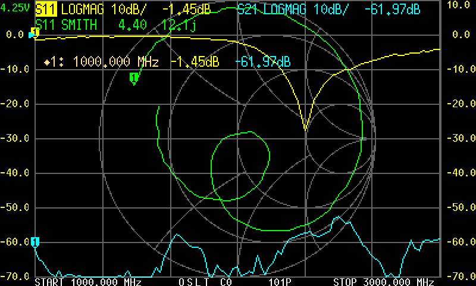
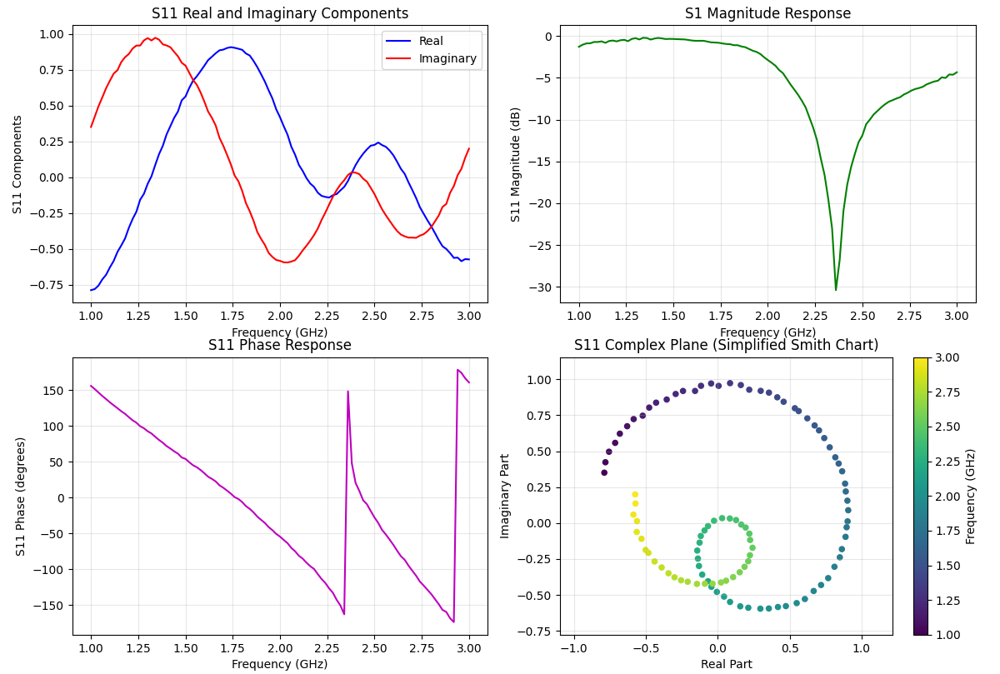
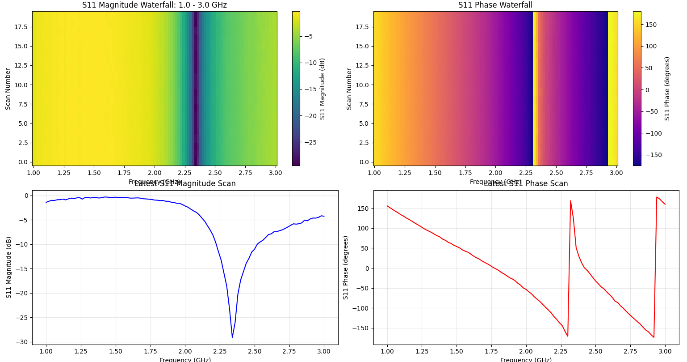
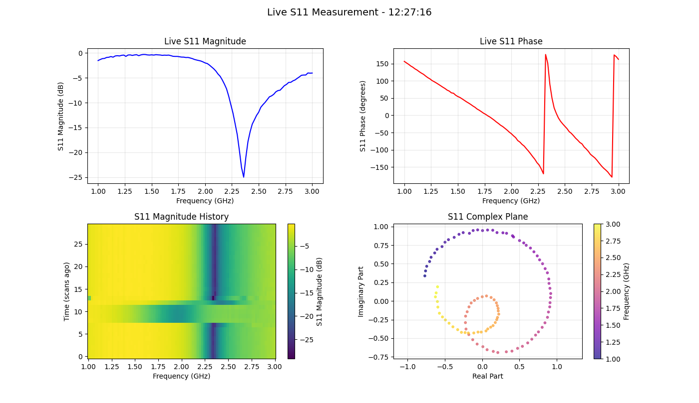

# nanoVNA_python

[](https://badge.fury.io/py/nvnapython)
[](https://pypi.org/project/nvnapython/)
[](https://pypi.org/project/nvnapython/)
[](https://pepy.tech/project/nvnapython)
[](https://www.gnu.org/licenses/old-licenses/gpl-2.0.en.html)
[](https://doi.org/10.5281/zenodo.20685801)


## AN UNOFFICIAL Python API for the NanoVNA Device Series

A non-GUI Python API for the NanoVNA series of vector network analyzers. 

This repository uses official resources and documentation but is NOT endorsed by the official NanoVNA product or company. See the [references](#references) section for further reading. See the [official NanoVNA resources](https://nanovna.com/) and the [active user group](https://groups.io/g/nanovna-users/) for device features.

This library covers most of the documented commands for the NanoVNA device series. The documentation (after the examples) is sorted by the serial command for the device, with usage examples provided. While some error checking exists in both the device and the library, it is not exhaustive. It is strongly advised to read the official documentation before scripting with your NanoVNA device. Operating the device experimentally or without referencing the official documents runs the risk of **damaging your device or connected equipment**.


There also exists several officially recognized resources:
* [NanoVNA-App](https://nanovna.com/?page_id=141), download available on official page
    * With development at [https://github.com/OneOfEleven/NanoVNA-App](https://github.com/OneOfEleven/NanoVNA-App)   
* [NanoVNA-Saver](https://nanovna.com/?page_id=90)
    * With releases and download at [https://github.com/NanoVNA-Saver/nanovna-saver/releases](https://github.com/NanoVNA-Saver/nanovna-saver/releases)
* [NanoVNA-Web-Client / WebApp](https://nanovna.com/?page_id=26)
    * Works from https://cho45.stfuawsc.com/NanoVNA/ using the latest version of chrome browser, and as an Android .apk


This README provides example code for connecting to the device, scanning and plotting data, saving to CSV, capturing the screen, and running calibrations. Examples are not exhaustive. Refer to the [List of NanoVNA Commands and their Library Commands](#list-of-nanovna-commands-and-their-library-commands) for the tested commands. Alias functions are provided for convenience but are not exhaustive.

If you are interested in developing the PyPI package or making a custom local version, see [Library Development](#library-development) towards the end of this README.

The primary GitHub: [https://github.com/LC-Linkous/nanoVNA_python](https://github.com/LC-Linkous/nanoVNA_python)

The PyPI page: [https://pypi.org/project/nvnapython/](https://pypi.org/project/nvnapython/)


## Table of Contents
* [The NanoVNA Series of Devices](#the-nanovna-series-of-devices)
* [Library Usage](#library-usage)
    * [PyPI Install](#pypi-install)
    * [Local Install Using UV](#local-install-using-uv)
* [Requirements](#requirements)
* [Structure](#structure)
* [Running Tests](#running-tests)
* [Error Handling](#error-handling)
* [Example Implementations](#example-implementations)
    * [Finding the Serial Port](#finding-the-serial-port)
        * [Autoconnection with the nanoVNA_python Library](#autoconnection-with-the-nanovna_python-library)
        * [Manually Finding a Port on Windows](#manually-finding-a-port-on-windows)
        * [Manually Finding a Port on Linux](#manually-finding-a-port-on-linux)
    * [Serial Message Return Format](#serial-message-return-format)
    * [Connecting and Disconnecting the Device](#connecting-and-disconnecting-the-device)
    * [Toggle Error Messages](#toggle-error-messages)
    * [Device and Library Help](#device-and-library-help)
    * [Selecting a Device Model](#selecting-a-device-model)
    * [Getting Data from the Active Screen](#getting-data-from-the-active-screen)
    * [Saving Screen Images](#saving-screen-images)
    * [Plotting Data with Matplotlib](#plotting-data-with-matplotlib)
    * [Saving SCAN Data to CSV](#saving-scan-data-to-csv)
    * [Accessing the NanoVNA Directly](#accessing-the-nanovna-directly)
* [List of NanoVNA Commands and their Library Commands](#list-of-nanovna-commands-and-their-library-commands)
* [Additional Library Functions for Advanced Use](#additional-library-functions-for-advanced-use)
* [Library Development](#library-development)
* [Notes for Beginners](#notes-for-beginners)
    * [Vocab Check](#vocab-check)
    * [VNA vs. SA vs. LNA vs. SNA vs. SDR vs Signal Generator](#vna-vs-sa-vs-lna-vs-sna-vs-sdr-vs-signal-generator)
    * [Calibration Setup](#calibration-setup)
    * [Some General NanoVNA Notes](#some-general-nanovna-notes)
* [FAQs](#faqs)
* [References](#references)
* [Licensing](#licensing)


## The NanoVNA Series of Devices

The [NanoVNA line of devices](https://nanovna.com/?page_id=21) are a series of portable and pretty user-friendly vector network analyzer devices. There are several devices with different frequency ranges, so refer to [official documentation](https://nanovna.com/?page_id=21) to select one for your needs. There are also some very convincing knock-off devices, so ensure that you are purchasing an actual device from a [reputable vendor](https://nanovna.com/?page_id=121). 

This device is often compared to the [tinySA series of devices][https://tinysa.org/](https://tinysa.org/). The NanoVNA series is a handheld vector network analyzer (VNA), which measures the S-parameters (loosely: a type of response of a device or antenna) over at different frequencies, while a spectrum analyzer measures the amplitude of RF signals at different frequencies. There's a lot of overlap with the use of both devices, but the measurements are very different. A signal generator (one of the features of the tinySA) is exactly what it sounds like - it generates a signal at a specific frequency or frequencies at a specified power level.

Official documentation can be found at [https://nanovna.com/](https://nanovna.com/?page_id=21). The official Wiki is going to be more up to date than this repo with new versions and features, and they also have links to GUI-based software. Several community projects also exist on GitHub.

There is also a very active NanoVNA community at [https://groups.io/g/nanovna-users/](https://groups.io/g/nanovna-users/) exploring the device capabilities and its many features. 

The end of this README will have some references and links to supporting material, but it is STRONGLY suggested to do some basic research and become familiar with your device before attempting to script or write code for it. 


## Library Usage

This library is available via PyPI, local install, or by using the class directly. We recommend one of the install options.

Several usage examples are provided in the [Example Implementations](#example-implementations) section, including working with the hardware and plotting results with matplotlib. Runnable versions of all of them live in the `examples/` directory (see the [examples README](examples/README.md)).


### PyPI Install

The `nvnapython` package (from PyPI at [https://pypi.org/project/nvnapython/](https://pypi.org/project/nvnapython/)) can be installed with:

```python

pip install nvnapython

```

The GitHub repository is named `nanoVNA_python` to differentiate the working version (with extended documentation and runnable examples) from the installable package.


### Local Install Using UV

Developing a project, or running something custom? You can pull the code from GitHub and build + install the package locally.

(You can also use your favorite package manager. This is set up for UV, but the information for other setups is in the `nvnapython` directory.)

```python
# install UV
pip install uv

# navigate to the nvnapython directory
cd .\nvnapython

# build the package
# a 'dist' directory should be created in nvnapython
uv build

# install the package locally
pip install dist/nvnapython-<version>-py3-none-any.whl

```


## Requirements

The core library depends only on [pyserial](https://pypi.org/project/pyserial/) for device communication. The plotting and screen-capture examples additionally need numpy, matplotlib, and Pillow, which are grouped under the optional `[plotting]` extra:

```python
# core library only
pip install nvnapython

# with the plotting/imaging example dependencies
pip install "nvnapython[plotting]"
```

For users on Linux systems, `pyQt5` is used with `matplotlib` to draw the figures. `pyQT5` needs to be installed on Linux systems to follow the examples included in this README, but is not needed on all Windows machines. Install both if you have doubts; they're small packages and commonly used.


Python 3.9+ is recommended. The examples are written for a NanoVNA-F V2 by default but take `--start`, `--stop`, and `--points` arguments for other ranges.


## Structure

The public API is `from nvnapython import nanoVNA`, which exposes the full `nanoVNA` class. The per-command methods live in mixin modules under `_commands/` and are composed onto the `nanoVNA` class in `core.py`, which holds the shared state, serial handling, model envelope, and helper methods. `constants.py` holds the per-model envelopes (frequency range, max points, screen size, slot counts) and `_bounds.py` the range-checking helpers.

This library is also part of the `nanoVNA_python` repository, which includes more extensive documentation, runnable examples, and the working development. The GitHub repository is structured as follows:

```
nvnapython/
├── README.md
├── LICENSE
├── pyproject.toml
├── .gitignore
├── .python-version
├── examples/
│   ├── README.md
│   ├── hello_world.py
│   ├── using_autoconnect.py
│   ├── using_command_func.py
│   ├── identify_and_select_model.py
│   ├── basic_scan.py
│   ├── two_port_s21.py
│   ├── solt_calibration.py
│   ├── robust_acquisition_loop.py
│   ├── plotting_scan.py
│   ├── plotting_waterfall_static.py
│   ├── plotting_waterfall_realtime.py
│   ├── save_raw_to_csv.py
│   ├── save_scan_csv.py
│   └── screen_capture.py
├── src/
│   └── nvnapython/
│       ├── __init__.py
│       ├── core.py
│       ├── constants.py
│       ├── _bounds.py
│       ├── py.typed
│       └── _commands/
│           ├── __init__.py
│           ├── acquisition.py
│           ├── calibration.py
│           ├── display_ui.py
│           ├── markers_traces.py
│           ├── presets_config.py
│           └── system_info.py
└── tests/
    ├── __init__.py
    ├── conftest.py
    ├── fakes.py
    ├── readme_capture.md
    ├── collect_readme_data.py
    ├── run_all_tests.py
    ├── (test_*.py — see the package layout above)
    └── (diagnose_*.py — manual hardware diagnostics)
```


## Running Tests

This is primarily for development or advanced troubleshooting. These tests are for the API.

The test suite uses [pytest](https://docs.pytest.org/). Tests must be run from the `nvnapython` project directory (the one containing `pyproject.toml`), since the pytest configuration and the `hardware` marker are defined in `pyproject.toml`. Running from a different directory will produce an `Unknown pytest.mark.hardware` warning.

Install the test dependencies first:
```bash
pip install -e ".[test]"
# or, using pip directly:
pip install pytest pytest-cov
```

Run the suite (hardware tests self-skip when no device is connected):
```bash
python -m pytest
```

> **Note:** use `python -m pytest`, not `uv run pytest`. Running through `uv` here can create a stray virtual environment inside the project directory and tangle the test environment.

The suite is split into hardware-free tests and tests that need a connected NanoVNA. The hardware tests are marked with `@pytest.mark.hardware` and are skipped automatically when no device is detected:
```bash
# run ONLY the hardware-free tests (explicitly skip device tests)
python -m pytest -m "not hardware"

# run ONLY the hardware tests (requires a connected NanoVNA)
python -m pytest -m hardware
```

Hardware detection is intentionally NOT cached, so you can plug/unplug the device between runs without restarting the process. If a connected device is being skipped (e.g. a model reporting an unexpected USB PID), force the hardware tests with:
```bash
# Windows PowerShell
$env:NVNA_FORCE_HARDWARE = "1"; python -m pytest -m hardware

# Linux / macOS
NVNA_FORCE_HARDWARE=1 python -m pytest -m hardware
```

To see coverage while testing:
```bash
python -m pytest --cov=nvnapython --cov-report=term-missing
```

### Capturing real device responses

`tests/collect_readme_data.py` is a helper (not a pytest test) that connects to a real device, sends a set of read-only commands, and writes their verbatim responses to `tests/readme_capture.md`. The parsing tests (`test_parsing.py`, `test_hardware_captures.py`) then replay those exact device bytes through the library's real `clean_return`/parsing logic — proving the library handles true hardware output, not an idealized synthetic version. These run without a device, since the bytes are frozen in the capture file:
```bash
# auto-detect the serial port
python tests/collect_readme_data.py

# or specify the port explicitly
python tests/collect_readme_data.py --port COM22     # Windows
python tests/collect_readme_data.py --port /dev/ttyACM0   # Linux
```

### Manual hardware diagnostics

The `tests/diagnose_*.py` scripts are manual tools (not pytest tests) used during hardware bring-up to isolate timing and framing behavior — e.g. `diagnose_fastcmd.py` reproduced the rapid-command serial race, and the capture diagnostics measured the framebuffer transfer. They require a connected device and print their findings rather than asserting.

These are experimental in nature and have limitations. They are not designed to be exhaustive diagnostic tools, and are left in this repo for future development usage.


## Error Handling

Some error handling has been implemented for the individual functions in this library, but not for much of the device configuration. Most functions have a list of acceptable formats for input, which is included in the documentation. 

Two library-side toggles control how much the library reports:

* `set_verbose(True/False)` — when on, the library prints detailed status/diagnostic messages (which port it checks, what a method did, warnings). When off, it stays quiet.
* `set_error_byte_return(True/False)` — when on, a command the library rejects (bad argument, out-of-range value) returns an explicit `b'ERROR'`. When off, a rejected command returns the default empty `b''`.

The library validates many arguments before sending them (sweep point counts, frequency ranges, marker indices, slot numbers) against the selected model's envelope. Validation is not exhaustive, and the device performs its own checks too, so always consult the official documentation for valid ranges.


## Example Implementations

Runnable, standalone versions of every example below are in the `examples/` directory; each is a single file you can copy out and run. See [examples/README.md](examples/README.md) for the full list organized by task. The snippets here are illustrative.

All examples release the serial port in a `finally` block, so a failed run does not leave the port locked for the next run — a leaked handle is the usual cause of a `PermissionError` / "device not functioning" on the next attempt on Windows.

This library was developed on Windows and has been lightly tested on Linux. The main difference (so far) has been in the permissions for first access of the serial port, but there may be smaller bugs in format that have not been detected yet. 


### Finding the Serial Port

To start, a serial connection between the NanoVNA and user PC device must be created. There are several ways to list available serial ports. The library supports some rudimentary autodetection, but if that does not work instructions in this section also support manual detection. 


#### Autoconnection with the nanoVNA_python Library

`autoconnect()` scans the serial ports for a device matching the NanoVNA USB VID:PID (`0x0483:0x5740`) and connects to the first match. It returns **two booleans**, `(found, connected)`: `found` means a matching device was seen on some port; `connected` means the port was actually opened. These can differ a device can be found but fail to connect (port busy, held by another program, permissions).


If multiple devices have the same VID, then the first one found is used. If you are connecting multiple devices to a user PC, then it is suggested to connect them manually (for now). The NanoVNA and tinySA devices have the same VID and hardware identification for the serial ports.


```python
# import the library (installed package)
from nvnapython import nanoVNA

# create a new nanoVNA object
nvna = nanoVNA()

# set the return-message preferences
nvna.set_verbose(True)            # detailed messages
nvna.set_error_byte_return(True)  # explicit b'ERROR' on a rejected command

# attempt to autoconnect
found, connected = nvna.autoconnect()

if connected:
    print("device connected")
    print(nvna.info())
    nvna.disconnect()
else:
    print("ERROR: could not connect to port")
```

#### Manually Finding a Port on Windows

If autoconnect does not find your device (for example, a model with a different USB descriptor), you can find the COM port manually and pass it to `connect()`. 

1)  Open _Device Manager_, scroll down to _Ports (COM & LPT)_, and expand the menu. There should be a _COM#_ port listing "USB Serial Device(COM #)". If your NanoVNA is set up to work with Serial, this will be it. Note the `COMx` 

2) Then you can use the code below to confirm connection.This uses the pyserial library requirement already installed for this library.


```python
from nvnapython import nanoVNA
nvna = nanoVNA()
nvna.connect("COM22")     # use the COM number you found
```

If a device does not connect, use the code below to list all ports.

```python
import serial.tools.list_ports

ports = serial.tools.list_ports.comports()

for port, desc, hwid in ports:
    print(f"Port: {port}, Description: {desc}, Hardware ID: {hwid}")
```

Example output for this method (on Windows) is as follows:

```python

Port: COM4, Description: Standard Serial over Bluetooth link (COM4), Hardware ID: BTHENUM\{00001101-0000-1000-8000-00805F9B34FB}_LOCALMFG&0000\7&D0D1EE&0&000000000000_00000000
Port: COM3, Description: Standard Serial over Bluetooth link (COM3), Hardware ID: BTHENUM\{00001101-0000-1000-8000-00805F9B34FB}_LOCALMFG&0002\7&D0D1EE&0&B8B3DC31CBA8_C00000000
Port: COM22, Description: USB Serial Device (COM10), Hardware ID: USB VID:PID=0483:5740 SER=400 LOCATION=1-3

```

"COM22" is the port location of the NanoVNA that is used in the examples in this README.


#### Manually Finding a Port on Linux

On Linux the device usually appears as `/dev/ttyACM0` (or a higher number). List candidates with:

```bash
ls /dev/ttyACM*
# or inspect USB devices
dmesg | grep -i tty
```

Then connect explicitly. You may need to be in the `dialout` group (or use `sudo`) to access the port.

Ports can also be found from within your IDE:
```python
import serial.tools.list_ports

ports = serial.tools.list_ports.comports()

for port, desc, hwid in ports:
    print(f"Port: {port}, Description: {desc}, Hardware ID: {hwid}")

```

This method identified the `/dev/ttyACM0`. Now, when attempting to use the autoconnection feature, the following error was initially returned:

```python
[Errno 13] could not open port /dev/ttyACM0: [Errno 13] Permission denied: '/dev/ttyACM0'

```

This was due to not having permission to access the port. In this case, this error was solved by opening a terminal and executing `sudo chmod a+rw /dev/ttyACM0`. Should this issue be persistent, other solutions related to user groups and access will need to be investigated.  


Confirm connection to the nanoVNA with:

```python
from nvnapython import nanoVNA
nvna = nanoVNA()
nvna.connect("/dev/ttyACM0")
```


### Serial Message Return Format

This libary has iterated over several message return formats on the backend while interfacing with the device. All front-end commands remain the same.

The original message format:
```python
bytearray(b'info\r\nModel:        NanoVNA-F_V2\r\nFrequency:    50k ~ 3GHz\r\nBuild time:   Mar  2 2021 - 09:40:50 CST\r\nch> \r\n')
```

Cleaned version:

```python
bytearray(b'Model:        NanoVNA-F_V2\r\nFrequency:    50k ~ 3GHz\r\nBuild time:   Mar  2 2021 - 09:40:50 CST\r')
```

The device frames every reply by echoing the command, sending the payload (whitespace-separated values, one record per line, CR/LF terminated), and ending with the console prompt. On the NanoVNA-F V2 firmware tested here, the prompt is emitted as `ch> ` (with a trailing space) and is **doubled** at the end of each reply — the tail is `...\r\nch> \r\nch> `. The library's read logic consumes that whole prompt tail so leftover bytes don't corrupt the next command, and `clean_return()` strips the echoed-command line and the trailing prompt, leaving just the payload.

Two framing details worth knowing if you parse raw output yourself:

* `scan` output lines (outmask 2 and similar) carry a **trailing space** before the newline; the `frequencies` command's lines do **not**. `str.split()` handles both transparently.
* Binary replies (the `capture` framebuffer) are NOT line-framed and can contain bytes that happen to equal `ch>` or `>` — so binary reads are handled by byte count, not by scanning for the prompt (see [Saving Screen Images](#saving-screen-images)).

### Connecting and Disconnecting the Device
 
 This example shows the process for initializing, opening the serial port, getting device info, and disconnecting.

```python
from nvnapython import nanoVNA

nvna = nanoVNA()
nvna.set_verbose(True)
nvna.set_error_byte_return(True)

found, connected = nvna.autoconnect()      # or: nvna.connect("COM22")
if connected:
    print("device connected")
    # ... do work ...
    nvna.disconnect()                       # always release the port
else:
    print("ERROR: could not connect to port")
```


Example output for this method is as follows:

```python

bytearray(b'Model:        NanoVNA-F_V2\r\nFrequency:    50k ~ 3GHz\r\nBuild time:   Mar  2 2021 - 09:40:50 CST\r')

```


### Toggle Error Messages

Currently, the following can be used to turn on or off returned error messages.

1) the 'verbose' option. When enabled, detailed messages are printed out. 

2) the 'errorByte' option. When enabled, if there is an error with the command or configuration, `b'ERROR'` is returned instead of the default `b''`. 

```python
# detailed status messages ON
nvna.set_verbose(True)
# detailed status messages OFF
nvna.set_verbose(False)

# when a command is rejected, return an explicit b'ERROR'
nvna.set_error_byte_return(True)
# when a command is rejected, return the default b''
nvna.set_error_byte_return(False)
```

### Device and Library Help

The `help` return can be accessed via the `help()` function call.

```python
nvna.help()
```

Or access the command list via the `help` command through the passthrough, and the library exposes method-level docstrings for each wrapped command:

```python
# the device's built-in command list
print(nvna.command("help"))

# Python help for a library method
help(nvna.scan)
```

The `help` command returns bytearray in the format `bytearray(b'commands:......')`

### Selecting a Device Model

When using the library, the `nanoVNA()` class is seeded with the NanoVNA-F V2 envelope by default. 

If you have a different model, select its envelope so the library's range checks (sweep points, frequency range, screen size, slot counts) match your hardware. `select_existing_device()` changes **library-side bounds only**; it does not change anything on the device.

The shipped presets:

| Preset | Frequency range | Max points | Screen | Cal/preset slots |
|---|---|---|---|---|
| `NANOVNA_F_V2` (default) | 50 kHz – 3 GHz | 201 | 800×480 | 7 |
| `NANOVNA_F_V3` | 50 kHz – 6 GHz | 801 | 800×480 | 7 |
| `NANOVNA_H4` | 10 kHz – 1.5 GHz | 101 | 320×480 | 5 |
| `NANOVNA_GENERIC` | 10 kHz – 1.5 GHz | 101 | 320×240 | 5 |

```python
from nvnapython import nanoVNA
nvna = nanoVNA()

# see the available presets
print(nvna.list_known_models())          # NANOVNA_F_V2, NANOVNA_F_V3, NANOVNA_H4, NANOVNA_GENERIC

# select the one matching your unit (e.g. a NanoVNA-F V3)
nvna.select_existing_device("NANOVNA_F_V3")
print(nvna.get_device_model())

# the bounds now in effect
print(nvna.get_max_points())                                  # 801
print(nvna.get_min_device_freq(), nvna.get_max_device_freq()) # 50000.0  6000000000.0
print(nvna.get_screen_size())                                 # (800, 480)
```

Individual bounds can also be overridden directly with `set_max_points`, `set_min_device_freq` / `set_max_device_freq`, and `set_screen_size`. See `examples/identify_and_select_model.py` for a full read-identity-then-select walkthrough.

A note on the F V3 frequency ceiling: the device's firmware `info` banner reports `50k ~ 6.3GHz`, but the hardware only returns valid samples up to **6 GHz** — scanning above that yields all-zero data. The preset's `max_freq_hz` is set to the real 6 GHz limit accordingly. The library's bounds are a guardrail, not a hard wall: `command()` sends a raw command string with no validation, so you can always bypass the envelope when you know what you're doing.

### Getting Data from the Active Screen

See other sections for the following examples:
* [Saving Screen Images](#saving-screen-images)
* [Plotting Data with Matplotlib](#plotting-data-with-matplotlib)

The most straight forward way to get data from an active screen is with the `data` command. This will pull data from an active screen. It will not adjust the range or number of points before a read. If the range needs to be adjusted prior to a read, use `scan` instead.

S-parameter data for the most recent sweep is read with the `data` command: `data 0` returns S11, `data 1` returns S21, and `data 2`–`6` return the calibration tables. The matching frequency axis comes from `frequencies`.

```python
nvna.pause()                       # freeze the sweep so the read is stable
s11 = nvna.get_s11_data()          # data 0  -> real/imag pairs
freqs = nvna.frequencies()         # matching frequency axis (Hz)
nvna.resume()
```

### Analysis of the Returned Data from the NanoVNA

This first example shows how to get measured data on the screen (using `data`) or to specify the read range and then measure with `scan`. Data returned will always be in a bytearray, but it will need to be converted in order to work with it.


```python
# import the NanoVNA library (installed package: pip install -e . from the repo root)
from nvnapython import nanoVNA
import time

# create a new nanoVNA object
nvna = nanoVNA()
# set the return message preferences
nvna.set_verbose(True)            # detailed messages
nvna.set_error_byte_return(True)  # explicit b'ERROR' if a command is rejected

# attempt to autoconnect
found_bool, connected_bool = nvna.autoconnect()

# if port closed, then return error message
if connected_bool == False:
    print("ERROR: could not connect to port")
else:  # if port found and connected, then complete task(s) and disconnect
    # set up some parameters for the scan.
    # The NanoVNA takes frequencies in Hz, as ints.
    start = int(1e9)  # 1 GHz, as an int
    stop = int(3e9)   # 3 GHz, as an int
    pts = 200         # sample points (<= the model max; 201 on the F V2)

    # pause the live sweep so the reads are stable
    nvna.pause()

    # SCAN runs a fresh sweep and can change the range and number of points.
    # get the frequency values (the X axis of the sweep)
    freq = nvna.get_scan_frequencies(start, stop, pts)   # scan, outmask 1
    print(freq)
    # get the S11 data
    s11 = nvna.get_scan_s11(start, stop, pts)            # scan, outmask 2
    print(s11)
    # get the S21 data
    s21 = nvna.get_scan_s21(start, stop, pts)            # scan, outmask 4
    print(s21)

    # DATA reads back the most recent sweep already on the device (no new sweep).
    # get the S11 data
    s11 = nvna.get_s11_data()                            # data 0
    print(s11)
    # get the S21 data
    s21 = nvna.get_s21_data()                            # data 1
    print(s21)

    nvna.resume()       # resume so the screen isn't left frozen
    nvna.disconnect()
```

The requested frequencies are in the following format:
```python
bytearray(b'1000000 \r\n1020000 \r\n1040000 \r\n1060000 \r\n1080000 \r\n1100000 \r\n1120000 \r\n1140000 \r\n1160000 \r\n1180000 \r\n1200000 \r\n1220000 \r\n1240000 \r\n1260000 \r\n1280000 \r\n1300000 \r\n1320000 \r\n1340000 \r\n1360000 \r\n1380000 \r\n1400000 \r\n1420000 \r\n1440000 \r\n1460000 \r\n1480000 \r\n1500000 \r\n1520000 \r\n1540000 \r\n1560000 \r\n1580000 \r\n1600000 \r\n1620000 \r\n1640000 \r\n1660000 \r\n1680000 \r\n1700000 \r\n1720000 \r\n1740000 \r\n1760000 \r\n1780000 \r\n1800000 \r\n1820000 \r\n1840000 \r\n1860000 \r\n1880000 \r\n1900000 \r\n1920000 \r\n1940000 \r\n1960000 \r\n1980000 \r\n2000000 \r\n2020000 \r\n2040000 \r\n2060000 \r\n2080000 \r\n2100000 \r\n2120000 \r\n2140000 \r\n2160000 \r\n2180000 \r\n2200000 \r\n2220000 \r\n2240000 \r\n2260000 \r\n2280000 \r\n2300000 \r\n2320000 \r\n2340000 \r\n2360000 \r\n2380000 \r\n2400000 \r\n2420000 \r\n2440000 \r\n2460000 \r\n2480000 \r\n2500000 \r\n2520000 \r\n2540000 \r\n2560000 \r\n2580000 \r\n2600000 \r\n2620000 \r\n2640000 \r\n2660000 \r\n2680000 \r\n2700000 \r\n2720000 \r\n2740000 \r\n2760000 \r\n2780000 \r\n2800000 \r\n2820000 \r\n2840000 \r\n2860000 \r\n2880000 \r\n2900000 \r\n2920000 \r\n2940000 \r\n2960000 \r\n2980000 \r\n3000000 \r\n0 \r\n0 \r\n0 \r\n0 \r\n0 \r\n0 \r\n0 \r\n0 \r\n0 \r\n0 \r\n0 \r\n0 \r\n0 \r\n0 \r\n0 \r\n0 \r\n0 \r\n0 \r\n0 \r\n0 \r\n0 \r\n0 \r\n0 \r\n0 \r\n0 \r\n0 \r\n0 \r\n0 \r\n0 \r\n0 \r\n0 \r\n0 \r\n0 \r\n0 \r\n0 \r\n0 \r\n0 \r\n0 \r\n0 \r\n0 \r\n0 \r\n0 \r\n0 \r\n0 \r\n0 \r\n0 \r\n0 \r\n0 \r\n0 \r\n0 \r\n0 \r\n0 \r\n0 \r\n0 \r\n0 \r\n0 \r\n0 \r\n0 \r\n0 \r\n0 \r\n0 \r\n0 \r\n0 \r\n0 \r\n0 \r\n0 \r\n0 \r\n0 \r\n0 \r\n0 \r\n0 \r\n0 \r\n0 \r\n0 \r\n0 \r\n0 \r\n0 \r\n0 \r\n0 \r\n0 \r\n0 \r\n0 \r\n0 \r\n0 \r\n0 \r\n0 \r\n0 \r\n0 \r\n0 \r\n0 \r\n0 \r\n0 \r\n0 \r\n0 \r\n0 \r\n0 \r\n0 \r\n0 \r\n0 \r')
```
These frequencies represent where in the frequency range the measurements have been taken, and are returned in `kHz`. That is, the last reading before the padding 0-s start is '3000000'. This value is actually '3000000e3', or 3 GHz, not 3 MHz. 


Returned S11 and S21 data are in the format:
```python
bytearray(b'0.414528 0.623509 \r\n0.512547 0.542835 \r\n0.552637 0.489537 \r\n0.602180 0.444314 \r\n0.674851 0.374883 \r\n0.721209 0.316875 \r\n0.770192 0.216239 \r\n0.790564 0.140702 \r\n0.804490 0.037844 \r\n0.802676 -0.086580 \r\n0.784412 -0.188284 \r\n0.757563 -0.260674 \r\n0.718249 -0.342237 \r\n0.664428 -0.416341 \r\n0.617326 -0.480844 \r\n0.568474 -0.533208 \r\n0.492809 -0.581321 \r\n0.460760 -0.616593 \r\n0.384558 -0.668559 \r\n0.314043 -0.682421 \r\n0.245858 -0.719574 \r\n0.194356 -0.714597 \r\n0.118920 -0.738018 \r\n0.066108 -0.737820 \r\n0.010847 -0.744120 \r\n-0.045027 -0.754767 \r\n-0.101323 -0.761777 \r\n-0.172184 -0.763956 \r\n-0.248799 -0.752455 \r\n-0.322770 -0.734302 \r\n-0.386569 -0.712150 \r\n-0.465589 -0.678363 \r\n-0.538067 -0.640787 \r\n-0.614912 -0.575165 \r\n-0.675761 -0.518579 \r\n-0.719431 -0.459212 \r\n-0.762334 -0.381576 \r\n-0.804731 -0.287837 \r\n-0.828170 -0.205799 \r\n-0.847075 -0.126603 \r\n-0.857135 -0.029673 \r\n-0.849052 0.066982 \r\n-0.834792 0.182195 \r\n-0.805081 0.263328 \r\n-0.756838 0.355655 \r\n-0.699059 0.442736 \r\n-0.627638 0.513114 \r\n-0.526945 0.592252 \r\n-0.424149 0.632364 \r\n-0.313906 0.655601 \r\n-0.181712 0.653672 \r\n-0.125724 0.615638 \r\n-0.053355 0.591899 \r\n0.009786 0.579131 \r\n0.073450 0.570709 \r\n0.166064 0.538408 \r\n0.250542 0.481270 \r\n0.324851 0.387106 \r\n0.371485 0.280715 \r\n0.392284 0.164942 \r\n0.372584 0.048407 \r\n0.321884 -0.054561 \r\n0.248533 -0.125397 \r\n0.153565 -0.178265 \r\n0.061536 -0.194453 \r\n-0.013059 -0.182995 \r\n-0.085104 -0.155251 \r\n-0.138454 -0.125033 \r\n-0.184962 -0.078549 \r\n-0.225650 -0.029733 \r\n-0.239032 0.054426 \r\n-0.229694 0.126419 \r\n-0.195660 0.184412 \r\n-0.150762 0.222993 \r\n-0.089336 0.251350 \r\n-0.039771 0.261744 \r\n0.009027 0.261116 \r\n0.065524 0.260008 \r\n0.110400 0.234943 \r\n0.140959 0.225260 \r\n0.193066 0.202232 \r\n0.260522 0.159201 \r\n0.309473 0.106962 \r\n0.343722 0.029135 \r\n0.362852 -0.053262 \r\n0.367468 -0.136931 \r\n0.371292 -0.227675 \r\n0.363786 -0.314572 \r\n0.318734 -0.411707 \r\n0.260611 -0.519830 \r\n0.184881 -0.579277 \r\n0.113375 -0.670024 \r\n-0.006515 -0.709672 \r\n-0.088562 -0.746757 \r\n-0.209147 -0.763733 \r\n-0.318236 -0.751811 \r\n-0.424684 -0.736606 \r\n-0.525702 -0.713903 \r\n-0.608816 -0.662751 \r\n-0.673664 -0.612937 \r\n-0.737695 -0.554410 \r\n0.000000 0.000000 \r\n0.000000 0.000000 \r\n0.000000 0.000000 \r\n0.000000 0.000000 \r\n0.000000 0.000000 \r\n0.000000 0.000000 \r\n0.000000 0.000000 \r\n0.000000 0.000000 \r\n0.000000 0.000000 \r\n0.000000 0.000000 \r\n0.000000 0.000000 \r\n0.000000 0.000000 \r\n0.000000 0.000000 \r\n0.000000 0.000000 \r\n0.000000 0.000000 \r\n0.000000 0.000000 \r\n0.000000 0.000000 \r\n0.000000 0.000000 \r\n0.000000 0.000000 \r\n0.000000 0.000000 \r\n0.000000 0.000000 \r\n0.000000 0.000000 \r\n0.000000 0.000000 \r\n0.000000 0.000000 \r\n0.000000 0.000000 \r\n0.000000 0.000000 \r\n0.000000 0.000000 \r\n0.000000 0.000000 \r\n0.000000 0.000000 \r\n0.000000 0.000000 \r\n0.000000 0.000000 \r\n0.000000 0.000000 \r\n0.000000 0.000000 \r\n0.000000 0.000000 \r\n0.000000 0.000000 \r\n0.000000 0.000000 \r\n0.000000 0.000000 \r\n0.000000 0.000000 \r\n0.000000 0.000000 \r\n0.000000 0.000000 \r\n0.000000 0.000000 \r\n0.000000 0.000000 \r\n0.000000 0.000000 \r\n0.000000 0.000000 \r\n0.000000 0.000000 \r\n0.000000 0.000000 \r\n0.000000 0.000000 \r\n0.000000 0.000000 \r\n0.000000 0.000000 \r\n0.000000 0.000000 \r\n0.000000 0.000000 \r\n0.000000 0.000000 \r\n0.000000 0.000000 \r\n0.000000 0.000000 \r\n0.000000 0.000000 \r\n0.000000 0.000000 \r\n0.000000 0.000000 \r\n0.000000 0.000000 \r\n0.000000 0.000000 \r\n0.000000 0.000000 \r\n0.000000 0.000000 \r\n0.000000 0.000000 \r\n0.000000 0.000000 \r\n0.000000 0.000000 \r\n0.000000 0.000000 \r\n0.000000 0.000000 \r\n0.000000 0.000000 \r\n0.000000 0.000000 \r\n0.000000 0.000000 \r\n0.000000 0.000000 \r\n0.000000 0.000000 \r\n0.000000 0.000000 \r\n0.000000 0.000000 \r\n0.000000 0.000000 \r\n0.000000 0.000000 \r\n0.000000 0.000000 \r\n0.000000 0.000000 \r\n0.000000 0.000000 \r\n0.000000 0.000000 \r\n0.000000 0.000000 \r\n0.000000 0.000000 \r\n0.000000 0.000000 \r\n0.000000 0.000000 \r\n0.000000 0.000000 \r\n0.000000 0.000000 \r\n0.000000 0.000000 \r\n0.000000 0.000000 \r\n0.000000 0.000000 \r\n0.000000 0.000000 \r\n0.000000 0.000000 \r\n0.000000 0.000000 \r\n0.000000 0.000000 \r\n0.000000 0.000000 \r\n0.000000 0.000000 \r\n0.000000 0.000000 \r\n0.000000 0.000000 \r\n0.000000 0.000000 \r\n0.000000 0.000000 \r\n0.000000 0.000000 \r')
```

The last value before the padding is ` -0.737695 -0.554410`. The first number is the `real` part of the signal, and the second number is the `imaginary` part of the signal. All signals are returned in two parts for each measurement. 


### Saving Screen Images

<p align="center">
        
</p>
   <p align="center">Capture On-Screen Trace Data from 1 GHz to 3 GHzz</p>


 The `capture()` function can be used to capture the screen and output it to an image file. Note that the screen size varies by device. The library itself does not have a function for saving to an image (requires an additional library), but examples and the CLI wrapper have this functionality.

`capture()` reads the screen framebuffer (RGB565, 2 bytes per pixel) and `decode_capture()` turns it into a list of `(r, g, b)` pixels you can hand to Pillow. The capture path reads the binary frame by its known byte count (width × height × 2), strips the leading command echo and the trailing prompt, and leaves the buffer clean for the next command. This avoids the truncation/wrap and color-scramble that a text-style prompt-framed read produces on a binary payload. The width and height are known based on device selection.

```python
from PIL import Image
from nvnapython import nanoVNA

nvna = nanoVNA()
nvna.autoconnect()

width, height = nvna.get_screen_size()        # e.g. 800x480 on the F V2
raw = nvna.capture(width, height)             # exactly width*height*2 image bytes
nvna.disconnect()

pixels = nvna.decode_capture(raw, width, height)
img = Image.new("RGB", (width, height))
img.putdata(pixels)
img.save("screen.png")
```

A complete version with command-line options is `examples/screen_capture.py`. Note: if the device is interrupted mid-capture it can become briefly unresponsive (Windows may report "a device attached to the system is not functioning") — power-cycle the NanoVNA to recover, and avoid hammering captures back-to-back.


### Plotting Data with Matplotlib


#### **Example 1: Plot Trace Data**


<p align="center">
        
</p>
   <p align="center">Plotted On-Screen Trace Data of a Frequency Sweep from 1 GHz to 3 GHz</p>

A runnable version of this example is `examples/plotting_scan.py`.  

This example plots the last/current sweep of data from the NanoVNA device. `get_scan_s11()` (a `scan()` alias for outmask 2) gets the S11 trace data, and `convert_s11_data_to_arrays(...)` parses the returned real/imaginary pairs into arrays that are then plotted using `matplotlib`.


This example has 4 subplots because there is a lot of information returned with each sweep of the NanoVNA. The top, left plot shows the real and imaginary parts of the signal. This is the data as it is returned directly from the NanoVNA device. The top, right plot shows the calculated magnitude data. The bottom plots are the calculated phase response and Smith Chart, on the left and right, respectively. 


#### **Example 2: Plot a Static Waterfall using SCAN and Calculated Frequencies**

<p align="center">
        
</p>
   <p align="center">Waterfall Plot for SCAN Data Over 20 Readings</p>

A runnable version of this example is `examples/plotting_waterfall_static.py`.

This example uses the `scan()` read to collect data over a specified number of reads and then displays it as magnitude/phase waterfalls plus the latest single scan. Data is exported to a specified .csv for logging. The collection can be interrupted at any time in the terminal (typically Ctrl + C).

#### **Example 3: Plot a Realtime Waterfall using SCAN and Calculated Frequencies**

<p align="center">
        
</p>
   <p align="center">Waterfall Plot for SCAN Data in Realtime</p>

The full, runnable version of this example is at `examples/plotting_waterfall_realtime.py` . This is a longer example due to the acquisition thread and animation loop, but the nanoVNA interfacing follows the other examples.

This example uses the `scan()` read to get data directly from the NanoVNA device. A background thread acquires scans while `matplotlib` animates the latest trace plus a rolling history across the four plots. The scan can be interrupted at any time by closing the figure window.

**A note on update speed:** the refresh rate is bounded by how fast the device can produce a sweep, not by the plotting code. A sweep of a couple hundred points takes on the order of 1–2 seconds on the NanoVNA-F V2/V3 (a VNA makes a complex magnitude-and-phase measurement at every point), so the waterfall advances every couple of seconds. Lower the point count for a faster refresh at the cost of frequency resolution.


### Saving SCAN Data to CSV

`examples/save_raw_to_csv.py` saves frequency / real / imaginary, and `examples/save_scan_csv.py` adds derived magnitude (dB) and phase (deg) columns.

```python
import csv, numpy as np
from nvnapython import nanoVNA

nvna = nanoVNA()
nvna.autoconnect()
nvna.pause()
raw = nvna.get_scan_s11(int(1e9), int(3e9), 200)
nvna.resume()
nvna.disconnect()

# ... parse into freq/real/imag arrays (see example) ...
with open("s11.csv", "w", newline="") as f:
    w = csv.writer(f)
    w.writerow(["Frequency_Hz", "S11_Real", "S11_Imaginary"])
    # w.writerow([...]) per point
```

### Accessing the NanoVNA Directly

`command()` is a passthrough: it sends an arbitrary command string straight to the device and returns the cleaned reply, with **no** library-side error checking. Use it for device features the library does not wrap yet, or to experiment.

```python
# send a raw command exactly as the device expects it
raw = nvna.command("scan 150000 250000000 200 2")
print(raw)
nvna.resume()
```


## List of NanoVNA Commands and their Library Commands

The library wraps the documented NanoVNA serial commands. Each device command and its library method(s) are listed below. Alias methods (e.g. `get_*`) are provided for readability and are not exhaustive. Argument validation is performed against the selected model envelope where applicable.


This section is sorted by the NanoVNA commands, and includes:
* A brief description of what the command does
* What the original usage looked like
* The nanoVNA_python function call, or calls if multiple options exist 
* Example return, or example format of return
* Any additional notes about the usage

> **Note:** the exact command set and argument ranges vary by model and firmware. The mappings below were confirmed against the NanoVNA-F V2 (firmware 0.3.0). Always cross-check with your device's `help` output and official documentation.


Quick Link Table:
|  |   |     |   |       |      |      |
|-------|-------|-------|-------|-------|-------|-------|
| [beep](#beep) | [cal](#cal) | [capture](#capture) | [clearconfig](#clearconfig) | [cwfreq](#cwfreq) | [data](#data) | [edelay](#edelay) |
| [frequencies](#frequencies) | [help](#help) | [info](#info) | [LCD_ID](#LCD_ID) | [lcd](#lcd) | [marker](#marker) | [pause](#pause) |
| [pwm](#pwm) | [recall](#recall) | [reset](#reset) | [resolution](#resolution) | [restart](#restart) | [resume](#resume) | [save](#save) |
| [saveconfig](#saveconfig) | [scan](#scan) | [SN](#SN) | [sweep](#sweep) | [touchcal](#touchcal) | [touchtest](#touchtest) | [trace](#trace) |
| [version](#version) |  |  |  |  |  |  |


### **beep**
* **Description:** Turn the beep on or off. 
* **Original Usage:** `beep [on|off]`
* **Direct Library Function Call:** `beep()`
* **Example Return:** `b''`
* **Alias Functions:**
    * `beep_on()`
    * `beep_off()`
    * `beep_time(val=Int)`
* **CLI Wrapper Usage:**
* **Notes:** Beep plays a continious tone until it is turned off. 


### **cal**
* **Description:** Work through the calibration process. Requires physical interaction with the device
* **Original Usage:** `cal [load|open|short|thru|done|reset|on|off]`
* **Direct Library Function Call:** `cal(val=load|open|short|thru|done|reset|on|off|in)`
* **Example Return:** ``
* **Alias Functions:**
    * `cal_load()` - calibrate with the load connector
    * `cal_open()` - calibrate with the open connector
    * `cal_short()`- calibrate with the short connector
    * `cal_thru()` - calibrate with cable connected to both ports
    * `cal_done()` - done with calibration
    * `cal_reset()` - reset calibration data. Do this BEFORE calibrating
    * `cal_on()`  - start measuring with calibration, apply it to device
    * `cal_off()` - stop messing with calibration being applied to device
* **CLI Wrapper Usage:**
* **Notes:**  
    * `cal` - no argument gets the calibration status
    * `cal load` - calibrate with the load connector. Hardware must be attached before calibration
    * `cal open` - calibrate with the open connector. Hardware must be attached before calibration
    * `cal short` - calibrate with the open connector. Hardware must be attached before calibration
    * `cal thru` - calibrate with cable connected to both ports. Hardware must be attached before calibration
    * `cal done` - complete the calibration
    * `cal reset` - reset calibration data. Do this BEFORE calibrating
    * `cal on` - start measuring with calibration, apply it to device
    * `cal off` - stop measuring with calibration being applied to device
    * `cal in` - this is in the documentation, but has no button on the NanoVNA-F V2. Might be a later feature. 


### **capture**
* **Description:** Requests a screen dump to be sent in binary format of HEIGHTxWIDTH pixels of each 2 bytes
* **Original Usage:** `capture`
* **Direct Library Function Call:** `capture()`
* **Example Return:** `format:'\x00\x00\x00\x00\x00\x00\x00\...x00\x00\x00'`
* **Alias Functions:**
    * `capture_screen()`
* **CLI Wrapper Usage:**
* **Notes:** Screen resolution is 800x480 for the NanoVNA-F V2 and V3 (2 bytes per pixel, so 768000 image bytes). The data is little-endian, but note the per-pixel CHANNEL layout is not plain RGB565/BGR565 — on the F V2/V3 the 16-bit pixel packs green in the high 5 bits, blue in the middle 6, and red in the low 5. Use `decode_capture()` rather than rolling your own bit math; see [Saving Screen Images](#saving-screen-images). The capture stream also begins with a `capture\r\n` echo and ends with the `ch>` prompt; the library strips both and reads the frame by its known byte count.


### **clearconfig**
* **Description:** Resets the configuration data to factory defaults
* **Original Usage:** `clearconfig`
* **Direct Library Function Call:** `clear_config()`
* **Example Return:** `b'Config and all calibration data cleared. \r\n Do reset manually to take effect. Then do touch calibration and save.\r'`
* **Alias Functions:**
    * `clear_and_reset()`
* **CLI Wrapper Usage:**
* **Notes:** Requires password '1234'. Hardcoded. Other functions need to be used with this to complete the process. This causes the deletion of ALL settings and calibration. USE WITH CAUTION.


### **cwfreq**
* **Description:** Set the continuous wave (CW) pulse frequency
* **Original Usage:** `cwfreq {frequency in Hz}`
* **Direct Library Function Call:** `cwfreq(val=Int|Freq in Hz)`
* **Example Return:**  ``
* **Alias Functions:**
    * `set_cwfreq(val=Int|Freq in Hz)` 
* **CLI Wrapper Usage:**
* **Notes:**   


### **data**
* **Description:** Gets the trace data for either S11 or S21, or the calibration.
* **Original Usage:** `data {0..6}` 
* **Direct Library Function Call:** `data(val=None|0|1|2|3|4|5|6)`
* **Example Return:** 
    * `data 0`: 
    ` format bytearray(b'-0.086151 0.957274\r\n1.013057 -0.197761\r\n0.944041 -0.348532\r\n0.858225 -0....\r\n-0.588183 -0.481691\r\n-0.646600 -0.426130\r')`
    * `data 7`: out of bounds. 
    `bytearray(b'usage: data [array]\r')` 
* **Alias Functions:**
    * `get_s11_data()`
    * `get_s21_data()`
    * `get_load_cal_data()`
    * `get_open_cal_data()`
    * `get_short_cal_data()`
    * `get_thru_cal_data()`
    * `get_isolation_cal_data()`
* **CLI Wrapper Usage:**
* **Notes:**  S11 data is printed by default, but can be selected with input `0` for S11 and input `1` for S21. Higher values are returns for the calibration, according to some documenation online (see references).
    * `data 0` - S11
    * `data 1` - S21
    * `data 2` - cal load 
    * `data 3` - cal open
    * `data 4` - cal short
    * `data 5` - cal thru
    * `data 6` - cal isolation


### **edelay**
* **Description:** electrical delay. This lets users compensate for time delay caused by components attached to the port, such as cables, adapters, etc.
* **Original Usage:** `edelay id`
* **Direct Library Function Call:** `edelay(val=None|Int|Float)`
* **Example Return:** empty bytearray
* **Alias Functions:**
    * `get_edelay()`
    * `set_edelay(val=Int|Float)`
* **CLI Wrapper Usage:**
* **Notes:**  No params should get the current edelay value. If there is 1 parameter, the delay is in nanoseconds. 


### **frequencies**
* **Description:** Gets the frequencies used by the last sweep
* **Original Usage:** `frequencies`
* **Direct Library Function Call:**  `frequencies()`
* **Example Return:**  `b'1500000000\r\n... \r\n3000000000\r'`
* **Alias Functions:**
    * `get_last_freqs()`
* **CLI Wrapper Usage:**
* **Notes:**   


### **help**
* **Description:** Gets a list of the available commands. Can be used to call NanoVNA help directly.
* **Original Usage:** `help`
* **Direct Library Function Call:** `help(val=None|0|1)`
* **Example Return:**
```python
    bytearray(b'There are all commands\r\n
    help:                lists all the registered commands\r\n
    reset:               usage: reset\r\n
    cwfreq:        
    usage: cwfreq {frequency(Hz)}\r\n
    saveconfig:          usage: saveconfig\r\n
    clearconfig:         usage: clearconfig {protection key}\r\n
    data:  
    usage: data [array]\r\n
    frequencies:         usage: frequencies\r\n
    port:                usage: port {1:S11 2:S21}\r\n
    scan:
    usage: scan {start(Hz)} [stop] [points] [outmask]\r\n
    sweep:               usage: sweep {start(Hz)} [stop] [points]\r\n
    touchcal:            usage: touchcal\r\n
    touchtest:           usage: touchtest\r\n
    pause:               usage: pause\r\n
    resume:              usage: resume\r\n
    cal:
    usage: cal [load|open|short|thru|done|reset|on|off|in]\r\n
    save:                usage: save {id}\r\n
    recall:              usage: recall {id}\r\n
    trace:               usage: trace {id}\r\n
    marker:              usage: marker [n] [off|{index}]\r\n
    edelay:              usage: edelay {id}\r\n
    pwm:       
    usage: pwm {0.0-1.0}\r\n
    beep:                usage: beep on/off\r\n
    lcd:                 usage: lcd X Y WIDTH HEIGHT FFFF\r\n
    capture:      
    usage: capture\r\n
    version:             usage: Show NanoVNA version\r\n
    info:                usage: NanoVNA-F info\r\n
    SN:                  usage: NanoVNA-F ID\r\n
    resolution:          usage: LCD resolution\r\n
    LCD_ID:              usage: LCD ID\r')   
```
* **Alias Functions:**
    * `NanoVNA_Help()`
* **CLI Wrapper Usage:**
* **Notes:**  


### **info**
* **Description:** Displays various software/firmware and hardware information
* **Original Usage:** `info`
* **Direct Library Function Call:** `info()`
* **Example Return:** `bytearray(b'Model:        NanoVNA-F_V2\r\nFrequency:    50k ~ 3GHz\r\nBuild time:   Mar  2 2021 - 09:40:50 CST\r')`
* **Alias Functions:**
    * `get_info()`
* **CLI Wrapper Usage:**
* **Notes:** 


### **lcd**
* **Description:** Draw rectangles on the screen
* **Original Usage:** `lcd {X} {Y} {WIDTH} {HEIGHT} {FFFF}`
* **Direct Library Function Call:** `lcd()`
* **Example Return:** empty bytearray
* **Alias Functions:**
    * `draw_rect(X=Int, Y=Int, W=Int, H=Int, COL=4 digit hex)`
* **CLI Wrapper Usage:**
* **Notes:**  Pause the screen first, and then draw. When the screen refreshes, the rectangle will be erased from left to right.


### **LCD_ID**
* **Description:** Get the ID of the LCD screen
* **Original Usage:** `LCD_ID`
* **Direct Library Function Call:** `LCD_ID()`
* **Example Return:** `bytearray(b'118200\r')`
* **Alias Functions:**
    * `get_LCD_ID()`
* **CLI Wrapper Usage:**
* **Notes:** 


### **marker**
* **Description:** sets or dumps marker info
* **Original Usage:**  
    * `marker [n] [on|off|{index}]`
    * `marker [n] [off|{index}]`
    * `marker [n] peak`
* **Direct Library Function Call:** `marker(ID=Int|1..4, val="on"|"off"|"peak", idx=None|Int)`
* **Example Return:** 
    * `marker` with no active markers:
        * `bytearray(b'')` - no active markers
        * `bytearray(b'1 0 50\r\n2 40 0\r')` - 2 active markers
    * `marker 1 25` - marker 1, data reading point 25
        * `bytearray(b'')`
    * `marker 1` - information about location
        * `bytearray(b'1 25 2940000\r')`
    * `marker 1 peak` - moves marker 1 to peak
        * `bytearray(b'')`
* **Alias Functions:**
    * `get_all_marker_positions()`
    * `get_marker_position(ID=Int)`
    * `set_marker_position(ID=Int, idx=Int)` - idx is a point between 0-201, or whatever the limits of the reading for the device is if it's higher.
    * `marker_peak(ID=Int)`
    * `marker_on(ID=Int)`
    * `marker_off(ID=Int)`
* **CLI Wrapper Usage:**
* **Notes:**  
    * Marker indexes depend on what the device lists. 0 i
    * `marker` no argument gets the attributes of the active markers.
    * `marker {ID=integer}` gets the attributes of that marker
    * The frequency must be within the selected sweep range mode.
    * Alias functions need error checking. 


### **pause**
* **Description:** Pauses the sweep
* **Original Usage:** `pause`
* **Direct Library Function Call:** `pause()`
* **Example Return:** `bytearray(b'')`
* **Alias Functions:**
    * None
* **CLI Wrapper Usage:**
* **Notes:** 


### **pwm**
* **Description:** Adjusts the PWM of the screen. This is screen brightness in this application.
* **Original Usage:** `pwm`
* **Direct Library Function Call:** `pwm(val=Float|0.0-1.0)`
* **Example Return:** `bytearray(b'')`
* **Alias Functions:**
    * `set_screen_brightness(val=Float|0.0-1.0)`
* **CLI Wrapper Usage:**
* **Notes:** 
    * 0.1 is 10% brightness, etc.


### **recall**
* **Description:** Loads a previously stored calibration from the device
* **Original Usage:** ` recall 0..4...6`
* **Direct Library Function Call:** `recall(val=0|1|2|3|4|5|6)`
* **Example Return:** empty bytearray
* **Alias Functions:**
    * None
* **CLI Wrapper Usage:**
* **Notes:** where 0 is the startup preset. No arguments prints the frequency range of the save results. Appears to be the same as `save()` 


### **reset**
* **Description:** Resets the NanoVNA device. 
* **Original Usage:** `reset`
* **Direct Library Function Call:** `reset()`
* **Example Return:** empty bytearray, serial error message. depends on the system.
* **Alias Functions:**
    * `reset_device()`
* **CLI Wrapper Usage:**
* **Notes:**  Disconnects the serial too, so will need to reconnect to continue using. 


### **restart**
* **Description:** Restarts the NanoVNA after the specified number of seconds
* **Original Usage:** `restart {seconds}`
* **Direct Library Function Call:** `restart(val=0...)`
* **Example Return:** empty bytearray
* **Alias Functions:**
    * `restart_device()`
    * `cancel_restart()`
* **CLI Wrapper Usage:**
* **Notes:** 
    *  Has not worked in testing on development DUT, but appears to work on some devices online.
    *  0 seconds stops the restarting process. 


### **resolution**
* **Description:** Get the resolution of the LCD screen in pixels
* **Original Usage:** `resolution`
* **Direct Library Function Call:** `resolution()`
* **Example Return:** `bytearray(b'800,480\r')`
* **Alias Functions:**
    * `get_resolution()`
    * `lcd_resolution()`
* **CLI Wrapper Usage:**
* **Notes:** The screen resolution for the NanoVNA-F V2 and V3 is 800x480 pixels (width x height)


### **resume**
* **Description:** Resumes the sweep
* **Original Usage:** `resume`
* **Direct Library Function Call:** `resume()`
* **Example Return:** empty bytearray
* **Alias Functions:**
    * None
* **CLI Wrapper Usage:**
* **Notes:** 


### **save**
* **Description:** Saves the current calibration data. Might save the current trace settings and marker position.
* **Original Usage:** `save 0..4...6`
* **Direct Library Function Call:** `save(val=None|0..4..6)`
* **Example Return:** empty bytearray
* **Alias Functions:**
    * None
* **CLI Wrapper Usage:**
* **Notes:**  where 0 is the startup preset. No arguments prints the frequency range of the save results.


### **saveconfig**
* **Description:** Saves the device configuration data. This includes language and touch calibration. 
* **Original Usage:** `saveconfig`
* **Direct Library Function Call:** `save_config()`
* **Example Return:** empty bytearray
* **Alias Functions:**
    * None
* **CLI Wrapper Usage:**
* **Notes:** 
 

### **scan**
* **Description:** Performs a scan and optionally outputs the measured data
* **Original Usage:** `scan {start(Hz)} {stop(Hz)} [points] [outmask]`
* **Direct Library Function Call:** `scan(start, stop, pts, outmask)`
* **Example Return:** 
    * `scan 1000000 2000000`
        * No return. Sets the screen to scan between 1 MHz and 2 MHz. 
    * `scan 1000000 2000000 200`
        * `bytearray(b'')`. The outmask is `0` by default, so there's no printout.
    * `scan 1000000 2000000 200 1`
        * `bytearray(b'1000 \r\n1010 \r\n1020 \r\n1030 ... \r\n1980 \r\n1990 \r\n2000 ... \r\n0 \r'`
        * The freuency points are returned, including a buffer of `\r\n0`
        * Values are returned in `kHz`
    * `scan 1000000 2000000 200 1`
        * `bytearray(b'-1.134857 0.890570 \r\n-1.143237 0.889276... \r\n-1.411501 1.746581 \r\n-1.400607 1.754247 ... \r\n0.000000 0.000000 \r\n0.000000 0.000000 \r')`
        * The S11 data is complex, with real and imaginary values. The padding is also complex.
    * `scan 1000000 2000000 200 3`
        * `bytearray(b'1000 -1.124556 0.885832 \r\n1010 -1.133325 0.882054....\r\n0 0.000000 0.000000 \r\n0 0.000000 0.000000 \r')`
        *  When the frequency and S11 are returned, the data is the `freq in KHz` and then the 2 parts of the complex signal. The `padding` is has  3 blank float values.
    * `scan 1000000 2000000 200 7`
        * `bytearray(b'1000 -1.133184 0.885893 -0.000045 -0.000008 \r\n....\r\n0 0.000000 0.000000 0.000000 0.000000 \r'))`
        *  When the frequency, S11, and S21 are returned, the data is the `freq in KHz` and then the 2 parts of the EACH complex signal, 4 signal parts in total. The `padding` has 5 blank float values.
    * Returns for invalid input (the exact range is model-dependent; the F V2 reports 51-201, the F V3 reports 51-801):
        * `bytearray(b'sweep points exceeds range 51 -201\r')`
        * `bytearray(b'frequency range is invalid\r')`
* **Alias Functions:**
    * `scan_range(start=Int, stop=Int)` - Scans. sets boundaries, does not return data 
    * `get_scan_frequencies(start=Int, stop=Int, pts=Int)` - returns frequency data
    * `get_scan_s11(start=Int, stop=Int, pts=Int)` - returns S11 data
    * `get_scan_freqs_s11(start=Int, stop=Int, pts=Int)` - returns frequency and S11 data
    * `get_scan_s21(start=Int, stop=Int, pts=Int)` - returns S21 data
    * `get_scan_freqs_s21(start=Int, stop=Int, pts=Int)` - returns frequency and S21 data
    * `get_scan_s11_s21(start=Int, stop=Int, pts=Int)` - returns S11 and S21 data
    * `get_scan_freqs_s11_s21(start=Int, stop=Int, pts=Int)` - returns frequency, S11, and S21 data
* **CLI Wrapper Usage:**
* **Notes:**  
    * `start` and `stop` are required values of frequencies are in Hz. Frequency returns are in kHz.
    * `[points]` is the number of points in the scan. The MAX points is device dependent (201 on the F V2, 801 on the F V3). The library validates against the selected model envelope; `command()` bypasses that check.
    * `[outmask]` 
     * 0 = no printout
     * 1 = frequency vals
     * 2 = S11 of sweep points
     * 3 = frequency values & S11 of sweep pts
     * 4 = S21 of sweep pts
     * 5 = frequency values and & S21 data of sweep pts
     * 6 = S11 and S21 data of sweep points
     * 7 = frequency values, S11 and S21 data of sweep points
    

### **SN**
* **Description:** Get the unique serial number of the NanoVNA.
* **Original Usage:** `SN`
* **Direct Library Function Call:** `SN(None)`
* **Example Return:** `bytearray(b'20210413080156D7')`
* **Alias Functions:**
    * `get_SN()`
* **CLI Wrapper Usage:**
* **Notes:** 
    * NanoVNA-F ID  (hint returned by help for DUT)
    * The serial number is a 16-character hexadecimal string (not a 16-bit number).


### **sweep**
* **Description:** Set sweep mode, frequency and points
* **Original Usage:** 
    * `sweep {start(Hz)} {stop(Hz)} {points}`
    *  `sweep {start|stop|center|span|cw|points} {freq(Hz)}`
* **Direct Library Function Call:** `config_sweep(argName=start|stop|center|span|cw, val=Int|Float)` AND `preform_sweep(start, stop, pts)`
* **Example Return:** 
    * empty bytearray `b''`
    * bytearray(b'0 800000000 450\r')
* **Alias Functions:**
    * `get_sweep_params()`
    * `set_sweep_start(val=Int)` - val is frequency in Hz
    * `set_sweep_stop(val=Int)` - val is frequency in Hz
    * `set_sweep_center(val=Int)` - val is frequency in Hz
    * `set_sweep_span(val=Int)` - val is frequency in Hz
    * `set_sweep_cw(val=Int)` - val is frequency in Hz
    * `run_sweep(start=Int, stop=Int, pts=Int)`
* **CLI Wrapper Usage:**
* **Notes:**  
 * `sweep` with no arguments lists the current sweep settings, the frequencies specified should be within the permissible range. 
 * `sweep {integer}` is interpreted as start frequency value.
 * `sweep {integer} {integer}` is interpreted as start and stop frequencies.
 * `sweep {integer} {integer} {integer}` is interpreted as start and stop frequencies, and the number of points.
* `sweep start {integer}`: sets the start frequency of the sweep.
* `sweep stop {integer}`: sets the stop frequency of the sweep.
* `sweep center {integer}`: sets the center frequency of the sweep.
* `sweep span {integer}`: sets the span of the sweep.
* `sweep cw {integer}`: sets the continuous wave frequency (zero span sweep). 

 
### **touchcal**
* **Description:** starts the touch calibration. Physical interaction with the device screen is required.
* **Original Usage:** `touchcal`
* **Direct Library Function Call:** `touch_cal()`
* **Example Return:** empty bytearray
* **Alias Functions:**
    * `start_touch_cal()`
* **CLI Wrapper Usage:**
* **Notes:**  To save this, `saveconfig` must be used.


### **touchtest**
* **Description:** starts the touch test. When this command is used, the screen can be drawn on to check responsiveness. 
* **Original Usage:** `touchtest`
* **Direct Library Function Call:** `touch_test()`
* **Example Return:** empty bytearray
* **Alias Functions:**
    * `start_touch_test()`
* **CLI Wrapper Usage:**
* **Notes:**  There may be instructions on screen. Pause the screen first to see the marks made on the screen.


### **trace**
* **Description:** displays all or one trace information or sets trace related information. INCOMPLETE due to how many combinations are possible.
* **Original Usage:**  
    * `trace [0|1|2|3|all] [off|logmag|linear|phase|smith|swr|polar|delay|refpos|channel] [value]`
    * read the above as `trace {ID} {format/action} {value/channel}`
* **Direct Library Function Call:** `trace(ID=None|Int, trace_format=None|String, val=None|Int)` 
* **Example Return:** 
     * empty bytearray  `b''`
     * `trace`
        * `bytearray(b'0 LOGMAG S11 1.000000 7.000000\r\n1 LOGMAG S21 1.000000 7.000000\r\n2 SMITH S11 1.000000 0.000000\r')`
        * summary of all active traces
    * `trace 0` - Information on Trace 0, S11
        * `bytearray(b'0 LOGMAG S11\r')`
    * `trace 1` - Information on Trace 1, S21
        * `bytearray(b'1 LOGMAG S21\r')`
    * `trace 0 linear 1` - Set trace 0 to linear, and set the input from chanel 1 (port 2)
        * `bytearray(b'')`
    * `trace 0 linear` - set the format of trace 0 to linear. This trace is by default on channel 0 (port 1)
        * `bytearray(b'')`
* **Alias Functions:**
    * `get_all_trace_attr()`
    * `get_trace_attr(ID=Int|"all")`
    * `trace_off(ID=Int|"all")`
    * `set_trace_logmag(ID=Int|"all")`
    * `set_trace_linear(ID=Int|"all")`
    * `set_trace_phase(ID=Int|"all")`
    * `set_trace_smith(ID=Int|"all")`
    * `set_trace_polar(ID=Int|"all")`
    * `set_trace_swr(ID=Int|"all",val=Float|Int)`
    * `set_trace_refposition(ID=Int|"all",val=Float|Int)`
    * `set_trace_delay(ID=Int|"all",val=Float|Int)`
    * `set_trace_channel(ID=Int|"all", val=Int)`
* **CLI Wrapper Usage:**
* **Notes:** 
    * NOTE: Traces can be turned OFF programatically, but not ON.
    * `trace` no args returns characteristics of active traces
    * `trace {ID=integer}` gets characteristics of that trace. using 'all' returns information for all traces. 
    * `trace {ID=integer} {str=logmag|phase|smith|linear|delay|swr}`  The ID sets the trace ID, and the second argument indicates what trace data format is returned. 
    * `trace {ID=integer} {off}` turn the trace off. using 'all' will toggle all traces off. Traces cannot be turned 'on' with this method (conflicting documentation)
    * `trace {ID=integer} {str=scale|refpos|channel} {val=int}` the first argument is the ID of the trace. The second argument is an action to `scale` the trace by a numeric value, to set the reference position (`refpos`), or to set the channel. The third value specifies the value for the action.


### **version**
* **Description:** returns the firmware version
* **Original Usage:** `version`
* **Direct Library Function Call:** `version()` 
* **Example Return:** `bytearray(b'0.3.0')` (NanoVNA-F V2, firmware 0.3.0; the F V3 reports `0.5.8`)
* **Alias Functions:**
    * `get_version()`
* **CLI Wrapper Usage:**
* **Notes:** 


## Additional Library Functions for Advanced Use

### `command`
* **Description:** override library functions to run commands on the NanoVNA device directly. 
* **Original Usage:** None. 
* **Direct Library Function Call:** `command(val=Str)`
* **Example Usage:**:
    * example: `command("version")`
    * return: `b'0.3.0'`
    * example: `command("info")`
    * return: `b'Model:        NanoVNA-F_V2\r\nFrequency:    50k ~ 3GHz\r\nBuild time:   Aug 17 2021 - 16:13:15 CST'`
    * example: `command("scan 1000000 2000000 5 2")`
    * return: `b'0.414528 0.623509 \r\n0.512547 0.542835 \r\n0.552637 0.489537 \r\n0.602180 0.444314 \r\n0.674851 0.374883 \r'`        
* **Example Return:** command dependent
* **Alias Functions:**
    * None
* **CLI Wrapper Usage:**
* **Notes:** If unfamiliar with device and operation, DO NOT USE THIS. There is no error checking and you will be interfacing with the NanoVNA device directly.

```python
# send any command string directly to the device, no validation, cleaned reply returned
raw = nvna.command("info")
```

`command()` bypasses all library-side argument checking. It is the right tool for commands not yet wrapped, for experimentation, and for reproducing exact device behavior — but you are responsible for a valid command string.

Other library-side helpers (no device traffic): `set_verbose` / `get_verbose`, `set_error_byte_return` / `get_error_byte_return`, `set_serial_timeout` / `get_serial_timeout`, `set_serial_poll_interval` / `get_serial_poll_interval`, the model/bounds setters and getters listed under [Selecting a Device Model](#selecting-a-device-model), and `decode_capture` / `capture_to_pixels` for image decoding.

## Unrecognized Commands that Appear in Documentation

These commands return the error message `Command not recognised.` from the device, not the library. They may appear in some versions of the firmware, but have not done anything to the DUT (NanoVNA-F V2).

* `bandwidth`
* `color`
* `dump`
* `freq` (frequency command is fine, but not shorter version)
* `power`
* `scan_bin`
* `smooth`
* `tcxo`
* `threshold`
* `time`
* `transform`
* `vbat`
* `zero`
* `s21offset`


## Library Development

The package layout, optional-dependency split (`plotting`, `test`), and the `hardware` pytest marker are defined in `pyproject.toml`. To work on the library:

```bash
# clone, then from the nvnapython project directory:
pip install -e ".[plotting,test]"
python -m pytest                 # hardware tests self-skip without a device
```

The per-command methods live in mixin modules under `src/nvnapython/_commands/` and are composed onto the `nanoVNA` class in `core.py`. Adding a command usually means adding a method to the appropriate mixin and a command-construction test (assert the exact command string on the happy path; assert nothing is sent on the validation-error path). Parsing changes should be checked against the frozen captures in `tests/readme_capture.md` via the parsing tests.

A `docs` site for the library may be added later for stable releases.


## Notes for Beginners


This is a brief section for anyone that might have jumped in with a bit too much ambition. It is highly suggested to _read the manual_. 

Very useful, important documentation can be found at:
* The main website: [https://nanovna.com/](https://nanovna.com/)
* Common troubleshooting and help pages:
    * [About NanoVNA](https://nanovna.com/?page_id=21)
    * [Start Using a NanoVNA](https://nanovna.com/?page_id=60)
    * [How to Read the NanoVNA Screen](https://nanovna.com/?page_id=46)
    * [Calibrating the NanoVNA](https://nanovna.com/?page_id=2)
* The [Wiki and User Group](https://nanovna.com/?page_id=98)


This library was modified from the [tinySA_python library](https://github.com/LC-Linkous/tinySA_python), and much of the material orignated there. These ARE NOT the same device, and have very different functionality, but some of the menus and commands are in the same format.

* The [tinySA wiki](https://tinysa.org/wiki/pmwiki.php)
* The getting started [first use](https://tinysa.org/wiki/pmwiki.php?n=Main.FirstUse) page
* Frequently asked questions (FAQs) can be found on the [Wiki FAQs page](https://tinysa.org/wiki/pmwiki.php?n=Main.FAQ)


### Vocab Check

Running list of words and acronyms that get tossed around with little to no explanation. Googling is recommended if you are not familiar with these terms as they're essential to understanding device usage.

* **AGC** - Automatic Gain Control. This controls the overall dynamic range of the output when the input level(s) changes. 
* **Baud** - Baud, or baud rate. The rate that information is transferred in a communication channel. A baud rate of 9600 means a max of 9600 bits per second is transmitted.
* **Calibration standards:** known Short, Open, Load, and Thru references used to remove the test setup's own errors from measurements (see [Calibration Setup](#calibration-setup)).
* **DANL** -  Displayed Average Noise Level (DANL) refers to the average noise level displayed on a spectrum analyzer. 
* **dB** - dB (decibel) and dBm (decibel-milliwatts). dB (unitless) quantifies the ratio between two values, whereas dBm expresses the absolute power level (always relative to 1mW). 
* **DUT** - Device Under Test. Used here to refer to the singular device used while initially writing the API. 
* **IF** - Intermediate Frequency. A frequency to which a carrier wave is shifted as an intermediate step in transmission or reception - [Wikipedia](https://en.wikipedia.org/wiki/Intermediate_frequency)
* **LNA** - Low Noise Amplifier. An electronic component that amplifies a very low-power signal without significantly degrading its signal-to-noise ratio - [Wikipedia](https://en.wikipedia.org/wiki/Low-noise_amplifier)
* **Outmask** - "outmask" refers to a setting that determines additional formatting or optional features that are not a core argument for a command.
    * For example, with the **hop** command, this value controls whether the device's output is a frequency or a level (power) signal. When the outmask is set to "1", the tinySA will output a frequency signal. When set to "2", the outmask will cause the tinySA to output a level signal, which is a measure of the signal's power or intensity
* **RBW** - Resolution Bandwidth. Frequency span of the final filter (IF filter) that is applied to the input signal. Determines the fast-Fourier transform (FFT) bin size.
* **SDR*** - Software Defined Radio. This is a software (computer) controlled radio system capable of sending and receiving RF signals. This type of device uses software to control functions such as  modulation, demodulation, filtering, and other signal processing tasks. Messages (packets) can be sent and received with this device.
* **Smith chart:** a polar plot of complex reflection coefficient, the standard way to visualize S11.
* **Signal Generator** -  used to create various types of repeating or non-repeating electronic signals for testing and evaluating electronic devices and systems.
* **S-parameters** - are a way to characterize the behavior of radio frequency (RF) networks and components. They describe how much of a signal is reflected, transmitted or transferred between PORTS. In case of s11 (s-one-one), the return loss of a single antenna or port is measured. In s12 (s-one-two) or s21 (s-two-one), the interaction between ports is measured. 
* **SA** -  Spectrum Analyzer. A device that measures the (power) magnitude of an input signal vs frequency. It shows signal as a spectrum.
     * This is what the 'SA' in 'tinySA' is!
* **SA** -  Signal Analyzer. A device that measures the properties of a single frequency signal. This can include power, magnitude, phase, and other features such as  modulation. 
* **SNA** - Scalar Network Analyzer. A device that measures amplitude as it passes through the device. It can be used to determine gain, attenuation, or frequency response.  
* **Sweep:** stepping the source across a frequency range and measuring at each point.
* **SWR** - Standing Wave Ratio. SWR is an indication of how well an antenna is matched to a transmission line. A low SWR (close to 1:1) means there is minimal signal reflection and the power is being transmitted down the line eddiciently. A high SWR indicats and impedance mismatch between a DUT (or antenna, or network) and the transmission line, which in this case is internal to the NanoVNA.
* **VNA** - Vector Network Analyzer. A device that measures the network parameters of electrical networks (typically, s-parameters). Can measure both measures both amplitude and phase properties. The [wiki article on network analyzers]( https://en.wikipedia.org/wiki/Network_analyzer_(electrical)) covers the topic in detail.  

### VNA vs. SA vs. LNA vs. SNA vs. SDR vs Signal Generator
aka “what am I looking at and did I buy the right thing?”
 

**tinySA Vs. NanoVNA**: The tinySA and NanoVNA look a lot alike, and have some similar code, but they are NOT the same device. They are designed to measure different things. The tinySA is a spectrum analyzer (SA) while the NanoVNA is a vector network analyzer (VNA). Both have signal generation capabilities (to an extent, as OUTPUT), but the tinySA (currently) has expanded features for generating signals. This library was made for the NanoVNA line of devices. There is some overlap with the tinySA, but there is a seperate library for that device at [tinySA_python](https://github.com/LC-Linkous/tinySA_python).


**VNA** – a vector network analyzer (VNA) measures parameters such as s-parameters, impedance and reflection coefficient of a radio frequency (RF) device under test (DUT). A VNA is used to characterize the transmission and reflection properties of the DUT by generating a stimulus signal and then measuring the device's response. This can be used to characterize and measure the behavior of RF devices and individual components. 
    * ["What is a Vector Network Analyzer and How Does it Work?" - Tektronix ](https://www.tek.com/en/documents/primer/what-vector-network-analyzer-and-how-does-it-work)
    * [NanoVNA @ https://nanovna.com/](https://nanovna.com/)

**SA** - This one is context dependent. SA can mean either 'Spectrum Analyzer' (multiple frequencies) or 'Signal Analyzer' (single frequency). In the case of the tinySA it is 'Spectrum Analyzer' because multiple frequencies are being measured. A spectrum analyzer measures the magnitude of an external input signal vs frequency. It shows signal as a spectrum. The signal source does not need to be directly, physically connected to the SA, which allows for analysis of the wireless spectrum. This is the primary functionality of the tinySA, but it does have other features (such as signal generation). 

**SNA** – a scalar network analyzer (SNA) measures amplitude as it passes through the device. It can be used to determine gain, attenuation, or frequency response. scalar network analyzers are less expensive than VNAs because they only measure the magnitude of the signal, not the phase.

**LNA** - an electronic component designed to amplify weak incoming signals with minimal noise addition, thus improving the signal-to-noise ratio (SNR). This hardware is often attached (or built in) to the devices above. It is not a stand-alone device for signal generation or analysis. 

**SDR** - a software defined radio (SDR) is a software (computer) controlled radio system capable of sending and receiving RF signals. This type of device uses software to control functions such as  modulation, demodulation, filtering, and other signal processing tasks. Messages  can be sent and received with this device. 

**Signal Generator** - A signal generator is used to create various types of repeating or non-repeating electronic signals for testing and evaluating electronic devices and systems. These can be used for calibration, design, or testing. Some signal generators will only have sine, square, or pulses, while others allow for AM and FM modulation (which begins to crossover into SDR territory)

### Calibration Setup


A NanoVNA measures the network plus its own cables/connectors. Calibration removes the setup's contribution, or the device's "bias" in your measurments. The common procedure is **SOLT** (Short, Open, Load, Thru) where you attach each known standard in turn and the device computes the correction. Some devices might not have a 'Thru' option, but this is getting less common as the technology gets better. 

`examples/solt_calibration.py` walks through the SOLT proccess interactively. Calibrate over the same sweep range you intend to measure, and re-calibrate if you change cables or range. Meaningful S21 measurements require a calibration that includes the Thru step.


Some tips:
* The open, sort, and load pieces should be finger tight. If the piece will not turn, there's a high risk of cross threading if it's forced. 
* The thru calibration should be done with the included cable. The cable impedance needs to match the impedance of the calibration kit. These are usually 50 ohms, but may be 75 ohms.
* When the cable is attatched to port 1 and port 2, both connectors should be finger tight.


### Some General NanoVNA Notes

* The device performs a live sweep continuously; `pause()` before reading data for a stable result, and `resume()` afterward so the screen isn't left frozen.
* The `reset` command can drop the USB connection mid-read; handle it accordingly.
* An interrupted binary capture can leave the device briefly unresponsive — power-cycle to recover.
* Different models have different frequency ranges, point counts, and slot counts; select the right model envelope so the library's checks match your hardware.


## FAQs

### How should I be using this?

For scripting and automating measurements with a NanoVNA from Python when you don't need a full UI. This library does not replace the interactive UIs of the more official software. Instead, it makes the scripting process easier. 

This library is useful for repeated scans, logging to CSV, screen capture, calibration, and integrating measurements into larger workflows. Start with the `examples/` directory. Read the official device documentation before driving the hardware experimentally.

### Will this be made into a REAL Python library I can import into my project?

It is already available on PyPI as `nvnapython` (`pip install nvnapython`) and importable as `from nvnapython import nanoVNA`.

### How often is this library updated?

As development continues and as device behavior is confirmed on hardware. The GitHub repository tracks the working version. Stable versions are released to PyPI. Zenodo get periodic updates for research purposes.


## References


The original documentation for this project comes from the related [tinySA_python](https://github.com/LC-Linkous/tinySA_python) library. That library was taken and applied to the NanoVNA to get a baseline of what commands were shared, and what might be new (to the library) for the NanoVNA. These ARE NOT the same device, and have very different functionality, but some of the menus and commands are in the same format.


* NAnoVNA Documentation PDF (link to download from hosting website) download found late in the documentation process, but has been a valuable (cross)reference:
    * https://www.sysjoint.com/ueditor/php/upload/file/PDF/NanoVNA-F%20V3%20Portable%20Vector%20Network%20Analyzer%20User%20Guide%20V1.0.pdf

The NanoVNA main site:
* The main website: [https://nanovna.com/](https://nanovna.com/)
* Common troubleshooting and help pages:
    * [About NanoVNA](https://nanovna.com/?page_id=21)
    * [Start Using a NanoVNA](https://nanovna.com/?page_id=60)
    * [How to Read the NanoVNA Screen](https://nanovna.com/?page_id=46)
    * [Calibrating the NanoVNA](https://nanovna.com/?page_id=2)
* The [Wiki and User Group](https://nanovna.com/?page_id=98)


* The [tinySA wiki](https://tinysa.org/wiki/pmwiki.php)
* The getting started [first use](https://tinysa.org/wiki/pmwiki.php?n=Main.FirstUse) page
* Frequently asked questions (FAQs) can be found on the [Wiki FAQs page](https://tinysa.org/wiki/pmwiki.php?n=Main.FAQ)


* [tinySA HomePage](https://tinysa.org/wiki/)  https://www.tinysa.org/wiki/
    * [tinySA PC control](https://tinysa.org/wiki/pmwiki.php?n=Main.PCSW) 
        * https://tinysa.org/wiki/pmwiki.php?n=Main.PCSW 
    * [tinySA USB Interface page](https://tinysa.org/wiki/pmwiki.php?n=Main.USBInterface_)
        * https://tinysa.org/wiki/pmwiki.php?n=Main.USBInterface
    * [tinySA list of general pages](https://tinysa.org/wiki/pmwiki.php?n=Main.PageList) 
        * https://tinysa.org/wiki/pmwiki.php?n=Main.PageList

* [http://athome.kaashoek.com/tinySA/python/]( http://athome.kaashoek.com/tinySA/python/ )
* [official pyserial](https://pypi.org/project/pyserial/) https://pypi.org/project/pyserial/
* https://groups.io/g/tinysa/topic/tinysa_screen_capture_using/82218670
* The firmware on GitHub at https://github.com/erikkaashoek/tinySA
    * https://github.com/erikkaashoek/tinySA/blob/main/main.c


* Websites that have been trawled through for random bits of information:
    * [https://www.passion-radio.fr/](https://www.passion-radio.fr/)
        * They have a 'TinySA Menu Tree' PDF doc that has been very useful
    * [The main TinySA GitHub](https://github.com/erikkaashoek/tinySA/)
        * [main.c](https://github.com/erikkaashoek/tinySA/blob/434126dcc6eed40e4e9ba3d7ef67e17e0370c38f/main.c)
    * [Spectrum Analyzer How-To Guide: What They Are, What They Measure, & How to Use Them](https://www.tek.com/en/documents/primer/what-spectrum-analyzer-and-why-do-you-need-one)
        * https://www.tek.com/en/documents/primer/what-spectrum-analyzer-and-why-do-you-need-one


* Hardware, S-parameters and 2 port networks:
    * ["What is a Vector Network Analyzer and How Does it Work?" - Tektronix ](https://www.tek.com/en/documents/primer/what-vector-network-analyzer-and-how-does-it-work)
    * [https://en.wikipedia.org/wiki/Scattering_parameters](https://en.wikipedia.org/wiki/Scattering_parameters)
    * [https://www.microwaves101.com/encyclopedias/s-parameters](https://www.microwaves101.com/encyclopedias/s-parameters)
    * ["Network Theory - Two-Port Networks" - tutorialspoint.com](https://www.tutorialspoint.com/network_theory/network_theory_twoport_networks.htm)


## Licensing

This project is licensed under the GNU General Public License v2.0. See the [LICENSE](LICENSE) file for details.

In more detail:

The **code in this repository** has been released under GPL-2.0 for right now (and to have something in place rather than nothing). This licensing does NOT take priority over the official releases and the decisions of the NanoVNA team. This licensing does NOT take priority for any of their products, including the devices that can be used with this software. 


This software is released AS-IS, meaning that there may be bugs (especially as it is under development). 


This software is UNOFFICIAL, meaning that the NanoVNA team does not offer tech support for it, does not maintain it, and has no responsibility for any of the contents.